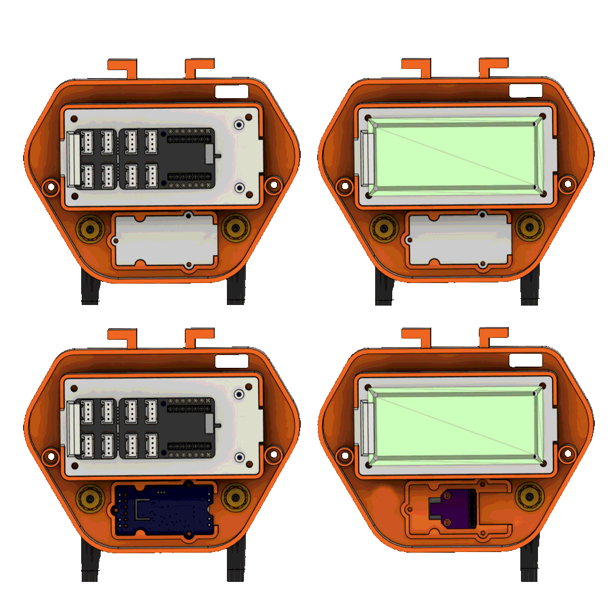
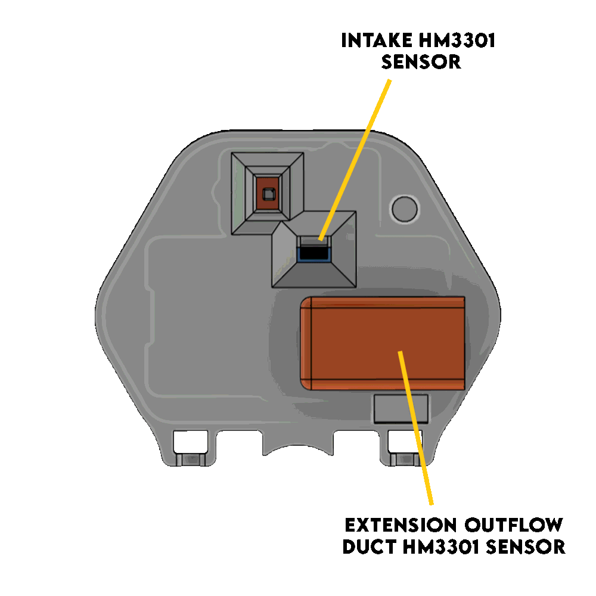
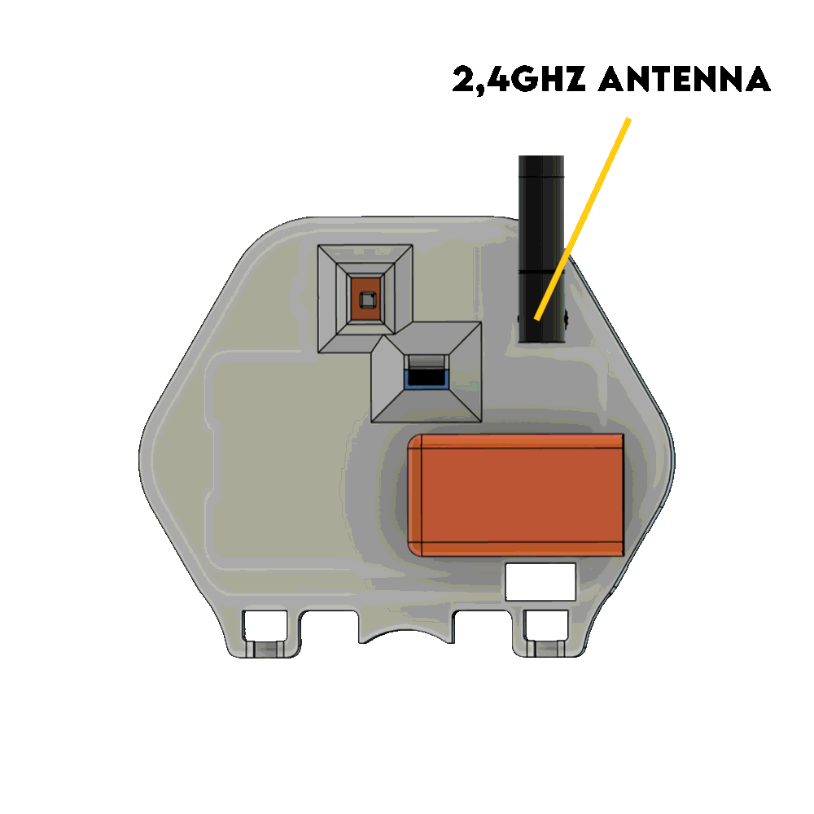
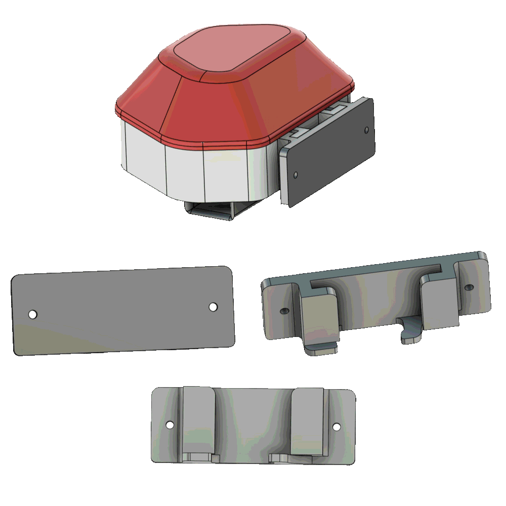
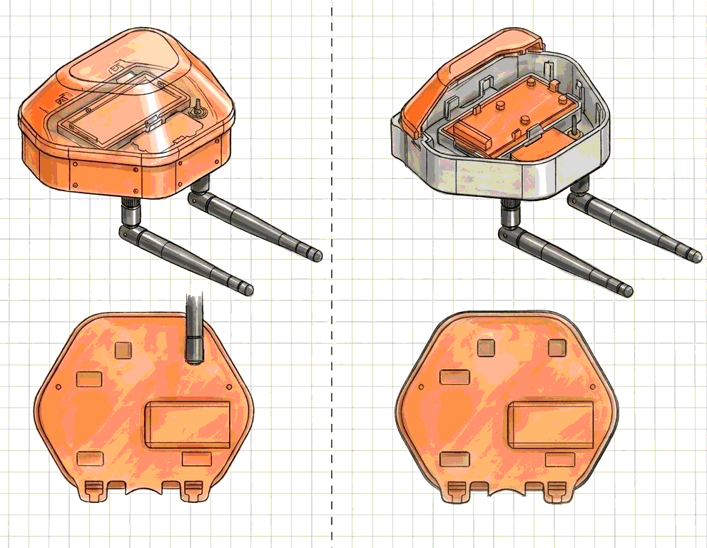

**English** · [Bahasa Indonesia](README.id.md) · [Español](README.es.md)

# Bayu v6 — the screwed V3 body

*Fab Lab Bali calls this design **DIY Environmental Sensor Node V3.1**. Same object, two
naming systems — see [Naming](#naming).*

3D-printed outdoor housing for the Making Sense Bali DIY air quality node.
*Bayu* — wind. The first iteration of the V3 generation: compact body, hybrid
electronics, LoRa option, assembled with screws.

> **Status: superseded by [`../bayu-v7/`](../bayu-v7/) (= Node V3.2).**
> v7 is the same body made screwless, with wall and pole mounting moulded into the back.
> It removes 11 screws and one printed part from the build and needs no bracket.
> **Build v7.** This folder stays because the STLs here are in the field already, and a
> builder holding a v6 shell needs the assembly steps for the one they have.

**Licence:** CERN-OHL-W-2.0 (hardware) · CC-BY-SA-4.0 (this documentation)
**Source:** *Dokumentasi Teknis: DIY Environmental Sensor Node V3*, Fab Lab Bali, September 2026. Translated from Indonesian.

## Contents

- [Naming](#naming)
- [Why the V3 generation exists](#why-the-v3-generation-exists)
- [Where the form came from](#where-the-form-came-from)
- [Hybrid architecture](#hybrid-architecture)
- [Airflow](#airflow)
- [Body variants](#body-variants)
- [Printed parts](#printed-parts)
- [Print settings](#print-settings)
- [Bill of materials](#bill-of-materials)
- [Wiring](#wiring)
- [Assembly](#assembly)
- [Mounting](#mounting)
- [Known issues with these files](#known-issues-with-these-files)
- [What v7 changed and why](#what-v7-changed-and-why)
- [What this documentation is still missing](#what-this-documentation-is-still-missing)

## Naming

Two naming systems collided in this folder tree and both are still in use.

| This repo | Fab Lab Bali | What it is |
|---|---|---|
| `bayu-v6/` (here) | **Node V3.1** | Screwed assembly, separate wall bracket. Superseded. |
| `bayu-v7/` | **Node V3.2** | Full screwless, integrated mounting. Build this one. |

These are the *same six STL files*, verified byte-for-byte against Fab Lab Bali's V3.1
release, not inferred from filenames:

| This repo | Upstream release |
|---|---|
| `stl/Main_Body.stl` | `MAIN BODY 2 ANTENNA.stl` |
| `stl/Main_Body_Cover.stl` | `TOP COVER.stl` |
| `stl/HM_Cover_and_Mainboard_Mount.stl` | `COVER HM3301 + BRACKET BOARD.stl` |
| `stl/Body_Air_Outlet.stl` | `OUTFLOW DUCT HM3301.stl` |
| `stl/BME_Cover.stl` | `COVER BME680.stl` |
| `stl/Body_Bracket.stl` | `BRACKET TO WALL.stl` |

The repo received these meshes in September 2026 without the document that described them,
which is why this README was almost entirely TODO markers until now. Note that the
repo's copy is the **dual-antenna** body; upstream also ships a single-antenna variant that
was never committed here.

Meanwhile the enclosure lineage counts v1-box → v2-lantern → v3-gourd → v4-column →
v5 pine cone → v6 → v7, and Fab Lab Bali counts whole-node generations V1 → V2 → V3.1 →
V3.2. The countings are unrelated. This is also *not*
[`../previous-iterations/node-v2/`](../previous-iterations/node-v2/), which is the second
generation of the whole node on a different shell entirely.

## Why the V3 generation exists

A regulatory-grade station costs more than any banjar, school or neighbourhood group in
Bali will raise on its own — the campaign's
[tier table](../../README.md#where-this-fits--the-campaigns-sensor-tiers) puts them at
USD 5,000–25,000+. Assembling one from cheap modular sensors is the obvious alternative,
and this whole folder tree is about the part that is actually hard: the box.

V3 was drawn against four problems the earlier nodes ran into.

1. **Component availability.** Committing to one PCB or one module stalls a build when
   local stock runs out. V3 accepts several.
2. **Exhaust re-suction.** In a compact enclosure the PM sensor's own outflow gets pulled
   back into its intake, and the node measures air it has already measured.
3. **Assembly and field maintenance.** A build with many small screws is slow to fabricate
   and worse to service on a roof. *(V3.1 does not solve this — v7 does.)*
4. **Mounting flexibility.** Walls and poles need different fixings without printing more
   parts. *(V3.1 does not solve this either — v7 does.)*

Goal: cut per-unit cost far enough that a resident can put a node on their own wall, and
get enough of them up that Bali has distributed, credible micro-scale air data.

> **On the cost claim.** The source document states a ~90% cut against a standard
> industrial station, in two different forms (chassis cost in one place, total cost in
> another) and names no baseline station. As written it cannot be checked. Against the
> campaign's own Tier 0 range the real saving is steeper than 90%, so the claim is probably
> conservative rather than inflated — but anyone quoting it to a funder should name a
> specific station and its price first.
> <!-- TODO: pick a named baseline station + price, restate the claim once, in one form. -->

## Where the form came from

The compartment layout is taken from the enclosure architecture of the **Smart Citizen Kit
station (SCK 2.3)** — the source names modularity, cleanliness and minimalism as what it
borrowed. The campaign's own calibration backbone is the **SCK 2.1**
([tier table](../../README.md#where-this-fits--the-campaigns-sensor-tiers)), so this is a
borrowing from the product line rather than from the exact station the nodes get measured
against.

> The source document's reference section reads *"the physical design and compartment
> placement on **Node V2**…"* — a copy-paste from the V2 document. The section describes V3.
> <!-- TODO: upstream typo, reported. -->

Reference: [Smart Citizen Kit and Station: An open environmental monitoring system for citizen participation and scientific experimentation](https://www.sciencedirect.com/science/article/pii/S2468067219300203)

## Hybrid architecture

One shell, several bills of materials — so a build is not blocked when one part is out of
stock locally.

**Mainboard** — Seeed Grove Shield for XIAO (solderless, plug-and-play) or a DIY custom
PCB (cheaper, needs soldering).

**Microcontroller** — XIAO ESP32-C3 or ESP32-S3; ESP32-C3 or ESP32-S3 Supermini on the DIY
PCB; or the Seeed ESP32-S3 with LoRa on board.

> **The Supermini and the XIAO are not pin-compatible on the DIY PCB.** I²C is D4/D5 for the
> XIAO and D8/D9 for the Supermini. Check [Wiring](#wiring) before soldering.

**Environmental sensor** — Bosch BME680 breakout or Seeed Grove BME680. On v6 both use the
same `BME_Cover.stl`; v7 splits them into two covers.

| Bosch breakout | Seeed Grove |
|---|---|
|  |  |

**PM sensor** — Seeed Studio HM3301 only, on I²C. No alternative is designed for.

**Power** — USB Type-C, 5 V DC.

## Airflow

Outside air is drawn in through the underside inlet to the HM3301's own fan. Measured air
leaves through `Body_Air_Outlet.stl`, which carries it sideways, away from the inlet, so it
is not immediately re-measured.

| | |
|---|---|
|  |  |

This fixes re-suction. It does **not** address the two failures found when the previous
node was co-located against a Smart Citizen Kit — the underside intake that flattened PM
peaks, and the BME680 self-heating inside the electronics bay. Both are unchanged in v6 and
in v7. See
[v7's honest note on this](../bayu-v7/README.md#what-this-design-does-and-does-not-fix),
which covers the whole V3 generation.

## Body variants

| Dual radio (2 antennas) | Single radio (1 antenna) |
|---|---|
|  |  |
| 2 SMA pigtail ports: Wi-Fi 2.4 GHz + sub-GHz LoRa | 1 SMA pigtail port: Wi-Fi 2.4 GHz |

Only the dual-antenna body is committed to this repo, as `stl/Main_Body.stl`. The
single-antenna variant exists in the
[upstream V3.1 release](https://drive.google.com/drive/folders/1vudckcW-5sOKlDBSPK77gQ5bCxbDxIM9);
if you need it, prefer [v7](../bayu-v7/), which ships both.

## Printed parts

Six parts. Measurements read from the meshes, so they are real; everything in
[Print settings](#print-settings) is not.

| Part | File | Bounding box (mm) | Triangles | Role |
|---|---|---|---|---|
| Main body | `stl/Main_Body.stl` | 113.9 × 92.0 × 28.9 | 5,242 | Chassis, dual antenna |
| Top cover | `stl/Main_Body_Cover.stl` | 117.9 × 88.0 × 51.9 | 13,324 | Screwed cover / shroud |
| HM3301 cover + board mount | `stl/HM_Cover_and_Mainboard_Mount.stl` | 83.9 × 40.1 × 8.9 | 1,522 | PM cover, carries the mainboard |
| Outflow duct | `stl/Body_Air_Outlet.stl` | 46.0 × 26.0 × 12.0 | 1,548 | Directs PM exhaust away from intake |
| BME680 cover | `stl/BME_Cover.stl` | 44.0 × 24.0 × 2.0 | 984 | Retains the BME680 |
| Wall bracket | `stl/Body_Bracket.stl` | 76.4 × 15.0 × 28.0 | 882 | Separate, bolted to the wall |

Parts are exported in assembly coordinates, not print coordinates — most have a negative Z
minimum. Slicers drop them to the bed, but the files are not pre-oriented for printing.

<!-- TODO: assembled outer dimensions and mass -->

## Print settings

<!-- TODO: none of this is known. Nothing below is a real value. -->

| | |
|---|---|
| Material | TODO — **PETG or ASA**. PLA creeps and sags in Bali sun |
| Layer height | TODO |
| Walls / perimeters | TODO |
| Infill | TODO |
| Nozzle / bed temperature | TODO |
| Supports | TODO — state per part |
| Print orientation | TODO — state per part; matters for watertightness and bracket strength |
| Estimated print time / filament | TODO |

State machine requirements in workshop terms — minimum build volume, nozzle diameter —
rather than by printer brand.

## Bill of materials

See [`bom.csv`](bom.csv) for the machine-readable version.

| # | Component | Spec / model | Qty | Note |
|---|---|---|---|---|
| 1 | Main processor | XIAO ESP32-C3 / ESP32-S3, Supermini, or Seeed ESP32-S3 with LoRa | 1 | Master on the I²C bus |
| 2 | Baseboard | Seeed Grove Shield **or** DIY custom PCB | 1 | |
| 3 | PM sensor | Seeed Studio HM3301 | 1 | Laser PM2.5 / PM10, I²C, 0x40 |
| 4 | Environmental sensor | Bosch BME680 **or** Seeed Grove BME680 | 1 | T / RH / pressure / gas, I²C, 0x76 or 0x77 |
| 5 | Power input | USB Type-C | 1 | 5 V DC |
| 6 | Pigtail | SMA female to IPEX / U.FL | 1–2 | 1 single-radio, 2 dual |
| 7 | External antenna | 2.4 GHz (+ sub-GHz LoRa if dual) | 1–2 | |
| 8 | Cable set | JST-XH and Grove 4-pin | 1 set | |
| 9 | Machine screw M3×10 | Flat head carbon steel | 4 | HM3301 cover |
| 10 | Machine screw M2×5 | Flat head carbon steel | 2 | Board bracket, per board type |
| 11 | Machine screw M2×10 | Flat head carbon steel | 3 | BME680 cover |
| 12 | Machine screw M3×10 | Flat head carbon steel | 2 | Top cover |

11 screws per node, which is the whole reason v7 exists.

> The source names NINDEJIN as the screw brand and gives "flat head" only — no drive type
> (Phillips, hex, slot). Any hardware-store equivalent works.
> <!-- TODO: screw drive type; prices; wall-fixing spec for the bracket. -->

**No prices.** The source document's V3 BoM has no price column. The
[Node V2 BoM](../previous-iterations/node-v2/bom.csv) carries IDR prices from an earlier
purchase on a different mainboard — order of magnitude only, not a quote.

## Wiring

Identical across the whole V3 generation. Rather than duplicate it, see
**[v7 § Wiring](../bayu-v7/README.md#wiring)** — three mainboard options, with schematics
and breadboard views.

> One correction carried there: the source document's Grove Shield table gives the HM3301
> **3.3 V**, while its own schematic gives **5 V**. The schematic is right — the HM3301's
> fan and laser will not run on 3.3 V.

## Assembly

Conventional, screw-based. Every internal part is held by a plate and small screws.

1. **Body.** Fit the SMA pigtail(s) through the antenna hole(s) in `Main_Body.stl` and
   tighten the nut from outside.
2. **BME680.** Drop the sensor into its pocket in the floor of the body. Fit `BME_Cover.stl`
   and tighten with **3 × M2×10**.
3. **HM3301 and duct.** Seat the PM sensor. Fit `Body_Air_Outlet.stl` into the exhaust
   channel. Fit `HM_Cover_and_Mainboard_Mount.stl` over the sensor and tighten with
   **4 × M3×10**.
4. **Mainboard.** Mount the board on the standoffs of `HM_Cover_and_Mainboard_Mount.stl`
   with **2 × M2×5**. Connect the I²C cables from BME680 and HM3301 and the USB-C power
   lead, and clip the pigtail onto the U.FL port.
5. **Close.** Fit `Main_Body_Cover.stl` and tighten with **2 × M3×10**, driven from outside
   the body.
6. **Bracket.** Bolt `Body_Bracket.stl` to the back of the body.

> The source document's V3.1 assembly section names `V3.1_Top_Cover.stl` and
> `V3.1_Wall_Bracket_Separate.stl`. **No such files exist** in the release — the real names
> are `TOP COVER.stl` and `BRACKET TO WALL.stl`, here `Main_Body_Cover.stl` and
> `Body_Bracket.stl`. Corrected above. <!-- TODO: upstream error, reported. -->

<!-- TODO: photograph a real assembly. Every image here is a CAD render. -->

## Mounting

**Flat wall only.** Fix `Body_Bracket.stl` to the wall with screws and wall plugs, then hang
the body on the bracket.

There is no pole option on v6 — no integrated cable-tie path. If the site is a pole or a
tree, use [v7](../bayu-v7/#mounting).

<!-- TODO: bracket fixing spec — screw size, spacing, plug type. Load rating. -->

## Known issues with these files

Found by mesh inspection on 2026-09-01, before publication:

- **`Main_Body.stl` is not watertight** — 4 open edges. Slicers usually repair it silently,
  which means the result is whatever your slicer decided. Re-export from source.
  **Fixed in v7**: its bodies have no open edges.
- **`Body_Air_Outlet.stl` has degenerate (zero-area) triangles.** Harmless in practice,
  cosmetically wrong. **Not fixed in v7** — the part is carried over unchanged.
- **No CAD source is published.** See [`cad/README.md`](cad/README.md). Same blocker on v7.

## What v7 changed and why

| | v6 / Node V3.1 | v7 / Node V3.2 |
|---|---|---|
| Top cover | Screws from outside | Detent snap-fit, 3 points |
| Sensor and board retention | M2/M3 screws through plates | Cantilever snap-fit hooks |
| Wall mounting | Separate printed bracket, bolted | Moulded screw holes in the body |
| Pole mounting | Not supported | Integrated cable-tie slots |
| Board bracket files | 1 | 2 — hook spacing differs by board |
| BME680 cover files | 1 | 2 — Bosch and Seeed footprints differ |
| Printed parts per node | 6 | 5 |
| Screws per node | 11 | 0 |

A sensor that opens without a screwdriver gets its PM sensor cleaned. One that needs a
driver of the right size, and four screws that do not roll off a roof, does not.

## What this documentation is still missing

- CAD source — the blocker on replication.
- Print settings. Nothing is known.
- Cost, in any currency.
- Assembly photographs. Every image is a render.
- Screw drive type; the bracket's wall-fixing spec and load rating.
- Assembled outer dimensions and mass; build time.
- Ingress rating — splash resistance is claimed, no test or rating named.
- A named baseline station for the ~90% cost claim.
- The single-antenna body variant, which exists upstream but is not committed here.

---

*Making Sense Bali · Chapter Fab City Bali · hosted by Fab Lab Bali.
Hardware CERN-OHL-W-2.0 · documentation CC-BY-SA-4.0.*
