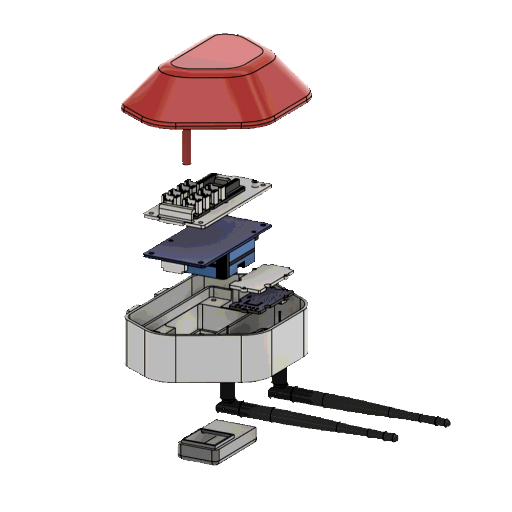
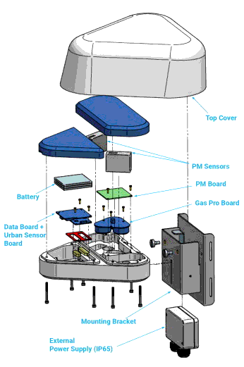
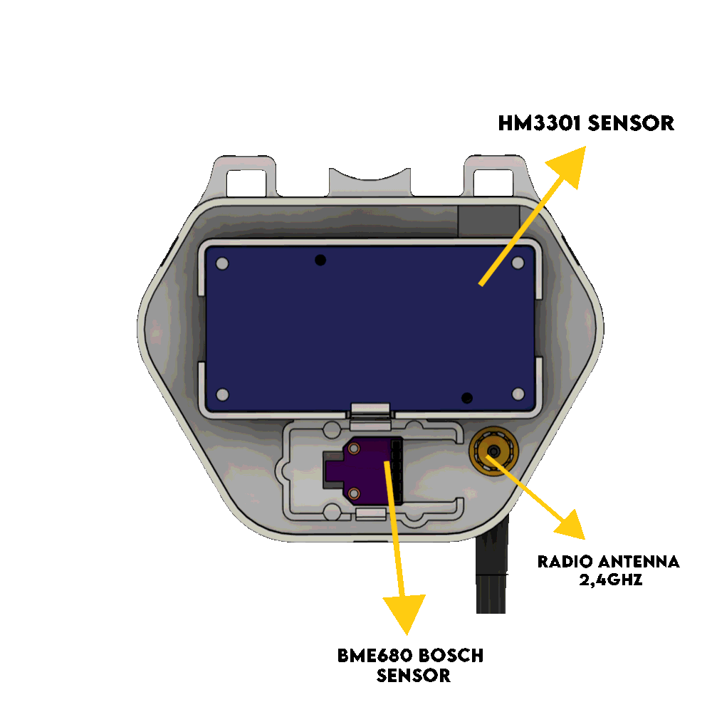
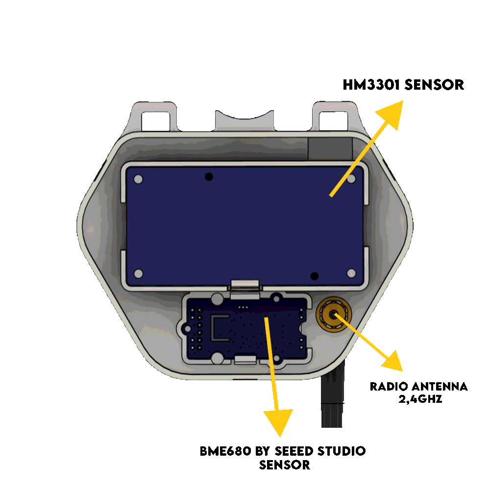
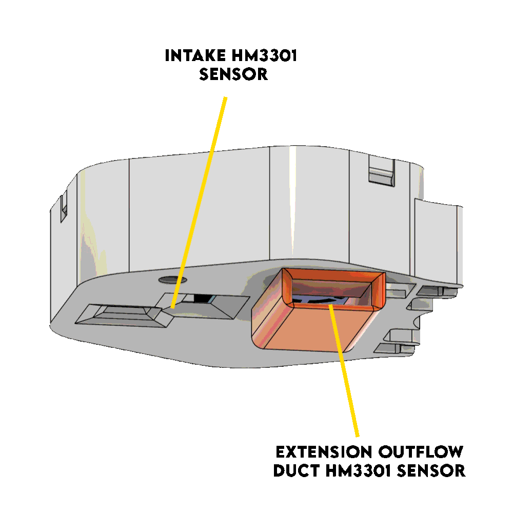
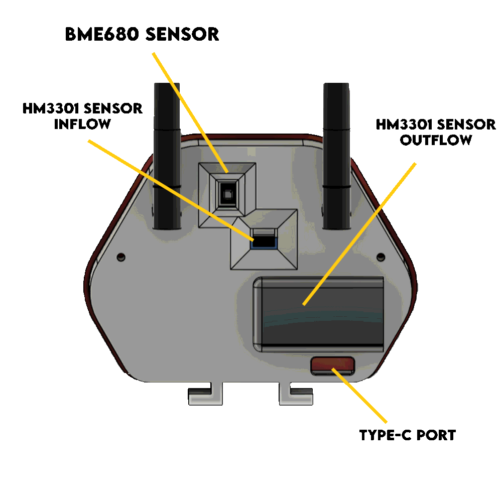
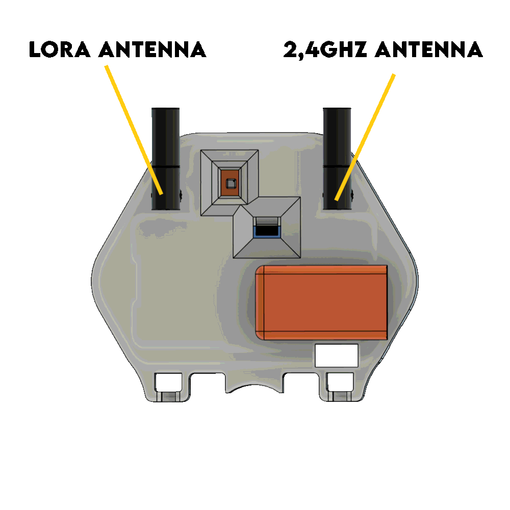

[English](README.md) · [Bahasa Indonesia](README.id.md) · **Español**

# Bayu v6 — el cuerpo V3 atornillado

*Fab Lab Bali llama a este diseño **DIY Environmental Sensor Node V3.1**. El mismo objeto, dos
sistemas de nomenclatura — ver [Nomenclatura](#nomenclatura).*

Carcasa de exterior impresa en 3D para el nodo DIY de calidad del aire de Making Sense Bali.
*Bayu* — viento. La primera iteración de la generación V3: cuerpo compacto, electrónica
híbrida, opción LoRa, ensamblado con tornillos.

> **Estado: reemplazado por [`../node-v3.2/`](../node-v3.2/) (= Node V3.2).**
> v7 es el mismo cuerpo hecho sin tornillos, con el montaje a pared y a poste moldeado en la parte trasera.
> Elimina 11 tornillos y una pieza impresa del armado y no necesita soporte.
> **Construye la v7.** Esta carpeta se mantiene porque los STL de aquí ya están en campo, y
> quien tenga en la mano una carcasa v6 necesita los pasos de ensamblaje de la que tiene.

**Licencia:** CERN-OHL-W-2.0 (hardware) · CC-BY-SA-4.0 (esta documentación)
**Fuente:** *Dokumentasi Teknis: DIY Environmental Sensor Node V3*, Fab Lab Bali, septiembre de 2026. Traducido del indonesio.

## Contenido

- [Nomenclatura](#nomenclatura)
- [Por qué existe la generación V3](#por-qué-existe-la-generación-v3)
- [De dónde viene la forma](#de-dónde-viene-la-forma)
- [Arquitectura híbrida](#arquitectura-híbrida)
- [Flujo de aire](#flujo-de-aire)
- [Variantes de cuerpo](#variantes-de-cuerpo)
- [Piezas impresas](#piezas-impresas)
- [Parámetros de impresión](#parámetros-de-impresión)
- [Lista de materiales](#lista-de-materiales)
- [Cableado](#cableado)
- [Ensamblaje](#ensamblaje)
- [Montaje](#montaje)
- [Problemas conocidos de estos archivos](#problemas-conocidos-de-estos-archivos)
- [Qué cambió la v7 y por qué](#qué-cambió-la-v7-y-por-qué)
- [Lo que todavía falta en esta documentación](#lo-que-todavía-falta-en-esta-documentación)

## Nomenclatura

Dos sistemas de nomenclatura chocaron en este árbol de carpetas y ambos siguen en uso.

| Este repositorio | Fab Lab Bali | Qué es |
|---|---|---|
| `node-v3.1/` (aquí) | **Node V3.1** | Ensamblaje atornillado, soporte de pared aparte. Reemplazado. |
| `node-v3.2/` | **Node V3.2** | Totalmente sin tornillos, montaje integrado. Construye esta. |

Estos son los *mismos seis archivos STL*, verificados byte a byte contra la publicación V3.1
de Fab Lab Bali, no deducidos de los nombres de archivo:

| Este repositorio | Publicación original |
|---|---|
| `stl/Main_Body.stl` | `MAIN BODY 2 ANTENNA.stl` |
| `stl/Main_Body_Cover.stl` | `TOP COVER.stl` |
| `stl/HM_Cover_and_Mainboard_Mount.stl` | `COVER HM3301 + BRACKET BOARD.stl` |
| `stl/Body_Air_Outlet.stl` | `OUTFLOW DUCT HM3301.stl` |
| `stl/BME_Cover.stl` | `COVER BME680.stl` |
| `stl/Body_Bracket.stl` | `BRACKET TO WALL.stl` |

El repositorio recibió estas mallas en septiembre de 2026 sin el documento que las describía,
y por eso este README fue casi por completo marcadores TODO hasta ahora. Nótese que
la copia del repositorio es el cuerpo de **antena doble**; el origen también publica una variante de
antena simple que nunca se subió aquí.

Mientras tanto, el linaje de la carcasa se cuenta v1-box → v2-lantern → v3-gourd → v4-column →
v5 pine cone → v6 → v7, y Fab Lab Bali cuenta generaciones de nodo completo V1 → V2 → V3.1 →
V3.2. Los dos conteos no tienen relación entre sí. Esto tampoco es
[`../node-v2/`](../node-v2/), que es la segunda
generación del nodo completo sobre una carcasa totalmente distinta.

## Por qué existe la generación V3

Una estación de grado regulatorio cuesta más de lo que cualquier banjar, escuela o grupo vecinal de
Bali va a reunir por su cuenta — la
[tabla de niveles](../../README.es.md) de la campaña las ubica en
USD 5,000–25,000+. Armar una con sensores modulares baratos es la alternativa evidente,
y todo este árbol de carpetas trata sobre la parte que de verdad es difícil: la caja.

La V3 se diseñó contra cuatro problemas con los que se toparon los nodos anteriores.

1. **Disponibilidad de componentes.** Comprometerse con una sola PCB o un solo módulo detiene una
   construcción cuando se agota el stock local. La V3 acepta varios.
2. **Reaspiración del escape.** En una carcasa compacta, el propio flujo de salida del sensor de PM
   vuelve a ser aspirado por su entrada, y el nodo mide aire que ya midió.
3. **Ensamblaje y mantenimiento en campo.** Un armado con muchos tornillos pequeños es lento de
   fabricar y peor de mantener sobre un techo. *(La V3.1 no resuelve esto — la v7 sí.)*
4. **Flexibilidad de montaje.** Paredes y postes necesitan fijaciones distintas sin imprimir más
   piezas. *(La V3.1 tampoco resuelve esto — la v7 sí.)*

Objetivo: bajar el costo por unidad lo suficiente para que un vecino pueda poner un nodo en su
propia pared, y lograr que haya los suficientes instalados para que Bali tenga datos de aire
distribuidos y creíbles a microescala.

> **Sobre la afirmación de costo.** El documento fuente declara un recorte de ~90% frente a una
> estación industrial estándar, en dos formas distintas (costo del chasis en un lugar, costo total
> en otro) y no nombra ninguna estación de referencia. Tal como está escrito, no se puede
> verificar. Frente al propio rango de Tier 0 de la campaña, el ahorro real es mayor que 90%, así
> que la afirmación probablemente sea conservadora antes que inflada — pero quien la cite ante un
> financiador debería nombrar primero una estación concreta y su precio.
> <!-- TODO: elegir una estación de referencia con nombre + precio, y enunciar la afirmación una sola vez, en una sola forma. -->

## De dónde viene la forma

La distribución de compartimentos está tomada de la arquitectura de carcasa de la **estación Smart
Citizen Kit (SCK 2.3)** — la fuente nombra modularidad, limpieza y minimalismo como lo que tomó
prestado. La columna vertebral de calibración de la propia campaña es la **SCK 2.1**
([tabla de niveles](../../README.es.md)), así que esto es un préstamo de la línea de
productos y no de la estación exacta contra la que se miden los nodos.

> La sección de referencias del documento fuente dice *"el diseño físico y la ubicación de
> compartimentos en el **Node V2**…"* — un copiar y pegar del documento de la V2. La sección describe la V3.
> <!-- TODO: error tipográfico del origen, ya reportado. -->

Referencia: [Smart Citizen Kit and Station: An open environmental monitoring system for citizen participation and scientific experimentation](https://www.sciencedirect.com/science/article/pii/S2468067219300203)

## Arquitectura híbrida

Una sola carcasa, varias listas de materiales — para que una construcción no quede bloqueada cuando
una pieza se agota localmente.

**Placa principal** — Seeed Grove Shield for XIAO (sin soldadura, se conecta y funciona) o una PCB
propia DIY (más barata, requiere soldar).

**Microcontrolador** — XIAO ESP32-C3 o ESP32-S3; ESP32-C3 o ESP32-S3 Supermini en la PCB DIY;
o el Seeed ESP32-S3 con LoRa integrado.

> **El Supermini y el XIAO no son compatibles pin a pin en la PCB DIY.** El I²C es D4/D5 para el
> XIAO y D8/D9 para el Supermini. Revisa [Cableado](#cableado) antes de soldar.

**Sensor ambiental** — breakout Bosch BME680 o Seeed Grove BME680. En la v6 ambos usan la misma
`BME_Cover.stl`; la v7 los separa en dos tapas.

| Breakout Bosch | Seeed Grove |
|---|---|
|  |  |

**Sensor de PM** — únicamente Seeed Studio HM3301, por I²C. No se contempla ninguna alternativa.

**Alimentación** — USB Type-C, 5 V CC.

## Flujo de aire

El aire exterior entra por la toma inferior hacia el ventilador propio del HM3301. El aire medido
sale por `Body_Air_Outlet.stl`, que lo lleva hacia un costado, lejos de la toma, para que no vuelva
a medirse de inmediato.

| | |
|---|---|
|  |  |

Esto corrige la reaspiración. **No** resuelve las dos fallas encontradas cuando el nodo anterior se
colocó junto a un Smart Citizen Kit — la toma inferior que aplanaba los picos de PM, y el
autocalentamiento del BME680 dentro del compartimento de electrónica. Ambas siguen igual en la v6 y
en la v7. Ver
[la nota franca de la v7 sobre esto](../node-v3.2/README.es.md),
que cubre toda la generación V3.

## Variantes de cuerpo

| Radio doble (2 antenas) | Radio simple (1 antena) |
|---|---|
|  |  |
| 2 puertos pigtail SMA: Wi-Fi 2.4 GHz + LoRa sub-GHz | 1 puerto pigtail SMA: Wi-Fi 2.4 GHz |

Solo el cuerpo de antena doble está subido a este repositorio, como `stl/Main_Body.stl`. La
variante de antena simple existe en la
[publicación original V3.1](https://drive.google.com/drive/folders/1vudckcW-5sOKlDBSPK77gQ5bCxbDxIM9);
si la necesitas, prefiere la [v7](../node-v3.2/), que incluye ambas.

## Piezas impresas

Seis piezas. Las medidas se leyeron de las mallas, así que son reales; nada de lo que está en
[Parámetros de impresión](#parámetros-de-impresión) lo es.

| Pieza | Archivo | Caja envolvente (mm) | Triángulos | Función |
|---|---|---|---|---|
| Cuerpo principal | `stl/Main_Body.stl` | 113.9 × 92.0 × 28.9 | 5,242 | Chasis, antena doble |
| Tapa superior | `stl/Main_Body_Cover.stl` | 117.9 × 88.0 × 51.9 | 13,324 | Tapa atornillada / cubierta |
| Tapa del HM3301 + soporte de placa | `stl/HM_Cover_and_Mainboard_Mount.stl` | 83.9 × 40.1 × 8.9 | 1,522 | Tapa del PM, sostiene la placa principal |
| Conducto de salida | `stl/Body_Air_Outlet.stl` | 46.0 × 26.0 × 12.0 | 1,548 | Aleja el escape del PM de la toma |
| Tapa del BME680 | `stl/BME_Cover.stl` | 44.0 × 24.0 × 2.0 | 984 | Sujeta el BME680 |
| Soporte de pared | `stl/Body_Bracket.stl` | 76.4 × 15.0 × 28.0 | 882 | Aparte, atornillado a la pared |

Las piezas están exportadas en coordenadas de ensamblaje, no de impresión — la mayoría tiene un Z
mínimo negativo. Los laminadores las bajan a la cama, pero los archivos no vienen preorientados
para imprimir.

<!-- TODO: dimensiones exteriores y masa del conjunto ensamblado -->

## Parámetros de impresión

<!-- TODO: nada de esto se conoce. Ningún valor de abajo es real. -->

| | |
|---|---|
| Material | TODO — **PETG o ASA**. El PLA fluye y se deforma bajo el sol de Bali |
| Altura de capa | TODO |
| Paredes / perímetros | TODO |
| Relleno | TODO |
| Temperatura de nozzle / cama | TODO |
| Soportes | TODO — indicar por pieza |
| Orientación de impresión | TODO — indicar por pieza; incide en la estanqueidad y en la resistencia del soporte |
| Tiempo de impresión / filamento estimados | TODO |

Enuncia los requisitos de máquina en términos de taller — volumen de impresión mínimo, diámetro de
nozzle — en vez de por marca de impresora.

## Lista de materiales

Ver [`bom.csv`](bom.csv) para la versión legible por máquina.

| # | Componente | Especificación / modelo | Cant. | Nota |
|---|---|---|---|---|
| 1 | Procesador principal | XIAO ESP32-C3 / ESP32-S3, Supermini, o Seeed ESP32-S3 con LoRa | 1 | Maestro en el bus I²C |
| 2 | Placa base | Seeed Grove Shield **o** PCB propia DIY | 1 | |
| 3 | Sensor de PM | Seeed Studio HM3301 | 1 | Láser PM2.5 / PM10, I²C, 0x40 |
| 4 | Sensor ambiental | Bosch BME680 **o** Seeed Grove BME680 | 1 | T / HR / presión / gas, I²C, 0x76 o 0x77 |
| 5 | Entrada de alimentación | USB Type-C | 1 | 5 V CC |
| 6 | Pigtail | SMA hembra a IPEX / U.FL | 1–2 | 1 para radio simple, 2 para doble |
| 7 | Antena externa | 2.4 GHz (+ LoRa sub-GHz si es doble) | 1–2 | |
| 8 | Juego de cables | JST-XH y Grove de 4 pines | 1 juego | |
| 9 | Tornillo de máquina M3×10 | Cabeza plana, acero al carbono | 4 | Tapa del HM3301 |
| 10 | Tornillo de máquina M2×5 | Cabeza plana, acero al carbono | 2 | Soporte de placa, según el tipo de placa |
| 11 | Tornillo de máquina M2×10 | Cabeza plana, acero al carbono | 3 | Tapa del BME680 |
| 12 | Tornillo de máquina M3×10 | Cabeza plana, acero al carbono | 2 | Tapa superior |

11 tornillos por nodo, que es justamente la razón por la que existe la v7.

> La fuente nombra a NINDEJIN como marca de tornillos y solo indica "cabeza plana" — sin tipo de
> huella (Phillips, hexagonal, ranura). Sirve cualquier equivalente de ferretería.
> <!-- TODO: tipo de huella del tornillo; precios; especificación de fijación a pared del soporte. -->

**Sin precios.** La BoM de la V3 del documento fuente no tiene columna de precio. La
[BoM del Node V2](../node-v2/bom.csv) trae precios en IDR de una compra
anterior sobre otra placa principal — solo como orden de magnitud, no como cotización.

## Cableado

Idéntico en toda la generación V3. En vez de duplicarlo, ver
**[v7 § Cableado](../node-v3.2/README.es.md)** — tres opciones de placa principal, con esquemáticos
y vistas de protoboard.

> Una corrección que se traslada allí: la tabla del Grove Shield del documento fuente da al HM3301
> **3.3 V**, mientras que su propio esquemático da **5 V**. El esquemático es el correcto — el
> ventilador y el láser del HM3301 no funcionan a 3.3 V.

## Ensamblaje

Convencional, a base de tornillos. Cada pieza interna se sujeta con una placa y tornillos pequeños.

1. **Cuerpo.** Pasa el o los pigtails SMA por el o los orificios de antena de `Main_Body.stl` y
   aprieta la tuerca desde afuera.
2. **BME680.** Coloca el sensor en su alojamiento en el piso del cuerpo. Monta `BME_Cover.stl`
   y aprieta con **3 × M2×10**.
3. **HM3301 y conducto.** Asienta el sensor de PM. Encaja `Body_Air_Outlet.stl` en el canal de
   escape. Coloca `HM_Cover_and_Mainboard_Mount.stl` sobre el sensor y aprieta con
   **4 × M3×10**.
4. **Placa principal.** Monta la placa sobre los separadores de `HM_Cover_and_Mainboard_Mount.stl`
   con **2 × M2×5**. Conecta los cables I²C del BME680 y del HM3301 y el cable de alimentación
   USB-C, y engancha el pigtail al puerto U.FL.
5. **Cierre.** Coloca `Main_Body_Cover.stl` y aprieta con **2 × M3×10**, atornillando desde fuera
   del cuerpo.
6. **Soporte.** Atornilla `Body_Bracket.stl` a la parte trasera del cuerpo.

> La sección de ensamblaje de la V3.1 del documento fuente nombra `V3.1_Top_Cover.stl` y
> `V3.1_Wall_Bracket_Separate.stl`. **No existe ningún archivo así** en la publicación — los nombres
> reales son `TOP COVER.stl` y `BRACKET TO WALL.stl`, aquí `Main_Body_Cover.stl` y
> `Body_Bracket.stl`. Corregido arriba. <!-- TODO: error del origen, ya reportado. -->

<!-- TODO: fotografiar un ensamblaje real. Cada imagen de aquí es un render CAD. -->

## Montaje

**Solo pared plana.** Fija `Body_Bracket.stl` a la pared con tornillos y tarugos, y luego cuelga
el cuerpo en el soporte.

En la v6 no hay opción de poste — no tiene paso integrado para amarres plásticos. Si el sitio es un
poste o un árbol, usa la [v7](../node-v3.2/#mounting).

<!-- TODO: especificación de fijación del soporte — medida de tornillo, separación, tipo de tarugo. Carga admisible. -->

## Problemas conocidos de estos archivos

Encontrados por inspección de mallas el 2026-09-01, antes de la publicación:

- **`Main_Body.stl` no es estanco** — 4 aristas abiertas. Los laminadores suelen repararlo en
  silencio, lo que significa que el resultado es lo que haya decidido tu laminador. Reexportar
  desde la fuente. **Corregido en la v7**: sus cuerpos no tienen aristas abiertas.
- **`Body_Air_Outlet.stl` tiene triángulos degenerados (de área cero).** Inofensivo en la práctica,
  incorrecto a nivel cosmético. **No corregido en la v7** — la pieza se arrastra sin cambios.
- **No se publica ninguna fuente CAD.** Ver [`cad/README.md`](cad/README.md). El mismo bloqueo en la v7.

## Qué cambió la v7 y por qué

| | v6 / Node V3.1 | v7 / Node V3.2 |
|---|---|---|
| Tapa superior | Tornillos desde afuera | Encaje a presión con retén, 3 puntos |
| Sujeción de sensores y placa | Tornillos M2/M3 a través de placas | Ganchos de encaje a presión en voladizo |
| Montaje a pared | Soporte impreso aparte, atornillado | Orificios de tornillo moldeados en el cuerpo |
| Montaje a poste | No soportado | Ranuras integradas para amarres plásticos |
| Archivos de soporte de placa | 1 | 2 — la separación de ganchos cambia según la placa |
| Archivos de tapa del BME680 | 1 | 2 — las huellas de Bosch y Seeed difieren |
| Piezas impresas por nodo | 6 | 5 |
| Tornillos por nodo | 11 | 0 |

Un sensor que se abre sin destornillador termina con su sensor de PM limpio. Uno que exige un
destornillador de la medida correcta, y cuatro tornillos que no deben rodar techo abajo, no.

## Lo que todavía falta en esta documentación

- Fuente CAD — el bloqueo para replicar.
- Parámetros de impresión. No se conoce nada.
- Costo, en cualquier moneda.
- Fotografías del ensamblaje. Cada imagen es un render.
- Tipo de huella de los tornillos; especificación de fijación a pared y carga admisible del soporte.
- Dimensiones exteriores y masa del conjunto ensamblado; tiempo de armado.
- Grado de protección contra ingreso — se declara resistencia a salpicaduras, sin ensayo ni grado nombrado.
- Una estación de referencia con nombre para la afirmación de ~90% de ahorro.
- La variante de cuerpo con antena simple, que existe en el origen pero no está subida aquí.

---

*Making Sense Bali · Chapter Fab City Bali · alojado por Fab Lab Bali.
Hardware CERN-OHL-W-2.0 · documentación CC-BY-SA-4.0.*
