**English** · [Bahasa Indonesia](README.id.md) · [Español](README.es.md)

# Node V3.2 — current canonical enclosure

*Fab Lab Bali's **DIY Environmental Sensor Node V3.2**. This folder was called `bayu-v7`
until September 2026 — see [Naming](#naming-read-this-before-you-search-the-repo).*

3D-printed outdoor housing for the Making Sense Bali DIY air quality node.
*Bayu* — wind. The whole V3 generation is an airflow argument, and v7 is the
iteration that stops using screws.

**Stage:** printable, field-ready pending co-location. Not yet replication-ready — no CAD source.
**Supersedes:** [`../node-v3.1/`](../node-v3.1/) (= Node V3.1) and everything in [`../previous-iterations/`](../previous-iterations/)
**Licence:** CERN-OHL-W-2.0 (hardware) · CC-BY-SA-4.0 (this documentation)
**Source:** *Dokumentasi Teknis: DIY Environmental Sensor Node V3*, Fab Lab Bali, September 2026. Translated from Indonesian.

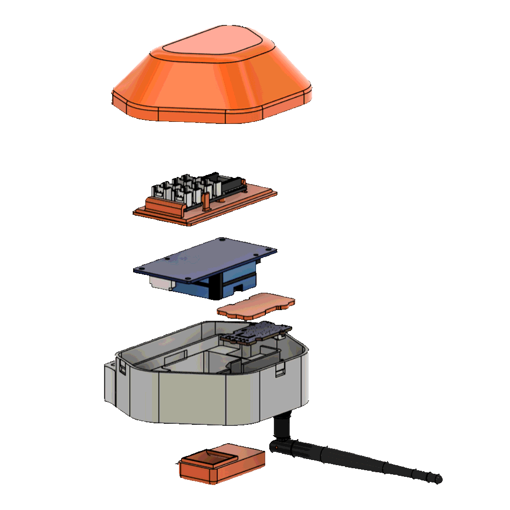

## Contents

- [Naming](#naming-read-this-before-you-search-the-repo)
- [What changed from v6](#what-changed-from-v6--node-v31)
- [What this design does and does not fix](#what-this-design-does-and-does-not-fix)
- [Hybrid architecture](#hybrid-architecture--what-you-can-substitute)
- [Airflow](#airflow)
- [Printed parts](#printed-parts)
- [Print settings](#print-settings)
- [Bill of materials](#bill-of-materials)
- [Wiring](#wiring)
- [Assembly](#assembly)
- [Mounting](#mounting)
- [Firmware and data flow](#firmware-and-data-flow)
- [Known issues with these files](#known-issues-with-these-files)
- [What this documentation is still missing](#what-this-documentation-is-still-missing)

## Naming, read this before you search the repo

Two naming systems collided in this folder tree and both are still in use.

| This repo | Fab Lab Bali | What it is |
|---|---|---|
| `node-v3.1/` | **Node V3.1** | Screwed assembly, separate wall bracket. Superseded. |
| `node-v3.2/` (here) | **Node V3.2** | Full screwless, integrated mounting. **Build this one.** |

`node-v3.1/` and Node V3.1 are the *same six STL files* — verified byte-for-byte, not
inferred from filenames. The repo received the meshes in September 2026 without the
document that described them; this folder and [`../node-v3.1/`](../node-v3.1/) are that
document, arriving late.

The enclosure lineage counts v1-box → v2-lantern → v3-gourd → v4-column → v5 pine cone →
v6 → v7. Fab Lab Bali counts whole-node generations: V1 → V2 → V3.1 → V3.2. The two
countings are unrelated and will keep colliding; the table above is the mapping.

## What changed from v6 (= Node V3.1)

| | v6 / Node V3.1 | **v7 / Node V3.2** |
|---|---|---|
| Top cover | Screws, driven from outside the body | **Detent snap-fit**, three locking points on the internal perimeter |
| Sensor and board retention | M2/M3 screws through cover plates | **Cantilever snap-fit hooks** on every internal part |
| Wall mounting | Separate printed bracket, bolted on | **Moulded screw holes** in the back of the body |
| Pole mounting | Not supported | **Integrated cable-tie slots** in the back of the body |
| Board bracket files | 1 (screws absorb the fit difference) | **2** — pick by mainboard, the hook spacing differs |
| BME680 cover files | 1 | **2** — Bosch breakout and Seeed Grove have different footprints |
| Printed parts to build one node | 6 | **5** (the wall bracket is gone) |

Screws eliminated from the build: **11 per node** (4 × M3×10, 3 × M2×10, 2 × M2×5, 2 × M3×10).
The only fasteners left are the SMA antenna nuts, which are hardware, not print.

Why it matters in the field: a sensor that opens without a screwdriver gets its PM sensor
cleaned. One that needs a driver, a driver of the right size, and four screws that do not
roll off a roof does not.

## What this design does and does not fix

The node this generation replaces was co-located against a Smart Citizen Kit and
[failed twice](../node-v2/README.md#evaluation--what-the-field-test-showed).
Being straight about which of those failures V3.2 addresses:

**Fixed — exhaust re-suction.** On a compact enclosure the PM sensor's own outflow gets
pulled back into its intake, and the node ends up measuring air it has already measured.
The [`OUTFLOW_DUCT_HM3301`](stl/OUTFLOW_DUCT_HM3301.stl) part carries the exhaust sideways,
away from the inlet. This is a real fix for a real problem.

**Not addressed — the two documented field failures.** Neither appears in the source
document, and the geometry says neither was designed against:

1. **Underside intake.** V2's evaluation found the downward-facing inlet restricted
   circulation, so PM spikes arrived late and flattened. V3.2's intake is still on the
   underside of the body ([`05-underside-intake-outflow.png`](../node-v3.1/img/05-underside-intake-outflow.png)).
   The V2 write-up's first requirement for V3 was *"intake from the top or open sides, not
   the bottom."* That requirement is not met.
2. **BME680 self-heating.** V2's evaluation found the ESP32's Wi-Fi radio heating the
   BME680 through a divider wall, pushing temperature above ambient and dragging RH down
   with it. V3.2 still seats the BME680 in a pocket of the main body, in the same sealed
   volume as the radio, under a flat printed cover — no radiation shield, no thermal break.
   The V2 write-up's second requirement is not met either.

<!-- TODO: this needs a decision from Fab Lab Bali, not a documentation fix. Either
     (a) co-locate a V3.2 against an SCK and publish the Δ°C and the PM lag — if the
     compact body turns out not to reproduce V2's errors, that result is worth more than
     the assumption; or (b) treat the temperature channel as diagnostic rather than
     ambient and label it that way on the dashboard. Do not leave it implied. -->

Until a V3.2 has been co-located, **treat its temperature and humidity channels as
unverified**, and expect PM peaks to read low. That is not a reason to stop deploying —
it is a reason to run the first-week co-location the campaign already requires of every
new node.

## Hybrid architecture — what you can substitute

The point of the V3 body is that local stock runs out. One shell, several bills of
materials.

**Mainboard** — pick one:

- **Seeed Grove Shield for XIAO.** Plug-and-play, no soldering. Takes a XIAO ESP32-C3 or ESP32-S3.
- **DIY custom PCB.** Cheaper, needs soldering. Takes a XIAO ESP32-C3/S3, an ESP32-C3/S3
  Supermini, or the Seeed ESP32-S3 with LoRa on board.

> **The Supermini and the XIAO are not pin-compatible on the DIY PCB.** I²C lands on D4/D5
> for the XIAO and D8/D9 for the Supermini. Check [Wiring](#wiring) before you heat the iron.

**Environmental sensor** — Bosch BME680 breakout, or Seeed Grove BME680. Different
footprints, so print the matching cover:
[`COVER_BME680_BOSCH.stl`](stl/COVER_BME680_BOSCH.stl) or
[`COVER_BME680_SEEED_STUDIO.stl`](stl/COVER_BME680_SEEED_STUDIO.stl).

**PM sensor** — Seeed Studio HM3301 only. No alternative is designed for.

**Radio** — the body comes in two variants: one SMA port (Wi-Fi) or two (Wi-Fi + sub-GHz
LoRa). LoRa is only available on the Seeed ESP32-S3 with the module on board.

**Power** — USB Type-C, 5 V DC.

## Airflow

Outside air is drawn in through the underside inlet to the HM3301's own fan. Measured air
leaves through the extension duct, which directs it sideways and away from the inlet so it
is not immediately re-measured.

Read that alongside [What this design does and does not fix](#what-this-design-does-and-does-not-fix)
— the duct solves re-suction, not intake restriction.

## Printed parts

**Five parts per node.** Two of the eight files are either/or pairs, and the two body
variants are a choice, not a set.

| Part | File | Qty | Note |
|---|---|---|---|
| Top cover | [`TOP_COVER.stl`](stl/TOP_COVER.stl) | 1 | Detent snap-fit |
| Main body — dual antenna | [`MAIN_BODY_2_ANTENNA.stl`](stl/MAIN_BODY_2_ANTENNA.stl) | 1 | **or** ↓ — Wi-Fi + LoRa |
| Main body — single antenna | [`MAIN_BODY_1_ANTENNA.stl`](stl/MAIN_BODY_1_ANTENNA.stl) | 1 | **or** ↑ — Wi-Fi only |
| BME680 cover — Seeed | [`COVER_BME680_SEEED_STUDIO.stl`](stl/COVER_BME680_SEEED_STUDIO.stl) | 1 | **or** ↓ |
| BME680 cover — Bosch | [`COVER_BME680_BOSCH.stl`](stl/COVER_BME680_BOSCH.stl) | 1 | **or** ↑ |
| HM3301 cover + board bracket — Grove Shield | [`COVER_HM3301_BRACKET_BOARD_GROVE_SHIELD.stl`](stl/COVER_HM3301_BRACKET_BOARD_GROVE_SHIELD.stl) | 1 | **or** ↓ |
| HM3301 cover + board bracket — DIY PCB | [`COVER_HM3301_BRACKET_BOARD_PCB_DIY.stl`](stl/COVER_HM3301_BRACKET_BOARD_PCB_DIY.stl) | 1 | **or** ↑ |
| Outflow duct | [`OUTFLOW_DUCT_HM3301.stl`](stl/OUTFLOW_DUCT_HM3301.stl) | 1 | Unchanged from v6 |

Measurements read from the meshes on 2026-09-23, so they are real. Everything in
[Print settings](#print-settings) is not.

| File | Bounding box (mm) | Triangles |
|---|---|---|
| `TOP_COVER.stl` | 117.9 × 88.0 × 32.0 | 14,154 |
| `MAIN_BODY_2_ANTENNA.stl` | 113.9 × 94.0 × 28.9 | 5,544 |
| `MAIN_BODY_1_ANTENNA.stl` | 113.9 × 94.0 × 28.9 | 5,422 |
| `COVER_HM3301_BRACKET_BOARD_GROVE_SHIELD.stl` | 80.2 × 43.3 × 12.4 | 5,166 |
| `COVER_HM3301_BRACKET_BOARD_PCB_DIY.stl` | 80.2 × 43.3 × 13.9 | 2,472 |
| `OUTFLOW_DUCT_HM3301.stl` | 46.0 × 26.0 × 12.0 | 1,548 |
| `COVER_BME680_BOSCH.stl` | 45.9 × 26.1 × 3.4 | 1,936 |
| `COVER_BME680_SEEED_STUDIO.stl` | 45.9 × 26.1 × 2.2 | 640 |

The body grew 2 mm in Y against v6 (92.0 → 94.0). That is the integrated mounting
features on the back face — the 2 mm is the wall bracket, absorbed into the body.

Parts are exported in assembly coordinates, not print coordinates — most have a negative Z
minimum. Slicers drop them to the bed, but the files are not pre-oriented for printing.

## Print settings

<!-- TODO: not one of these is known. Nothing in this table is a real value. Fab Lab Bali
     has printed these parts — the settings exist in someone's slicer profile. Export it. -->

| | |
|---|---|
| Material | TODO — **PETG or ASA**. PLA creeps and sags on a Bali roof; the parent README already rules it out |
| Layer height | TODO |
| Walls / perimeters | TODO — snap-fit hooks are the load path here, so this one is not cosmetic |
| Infill | TODO |
| Nozzle / bed temperature | TODO |
| Supports | TODO — state per part |
| Print orientation | TODO — state per part. Matters twice over on v7: layer direction decides whether a cantilever hook flexes or snaps off |
| Estimated print time / filament mass | TODO |

State machine requirements in workshop terms — minimum build volume, nozzle diameter —
rather than by printer brand. A lab in another city has a different machine.

**Snap-fit parts are more print-sensitive than screwed ones.** A cantilever hook printed
with the layer lines across its root is a hook that breaks on first assembly. Until the
orientation is documented, print the covers flat and expect to lose one.

## Bill of materials

See [`bom.csv`](bom.csv) for the machine-readable version in the repo's Open-Make columns.

| # | Component | Spec / model | Qty | Note |
|---|---|---|---|---|
| 1 | Main processor | XIAO ESP32-C3 / ESP32-S3, ESP32-C3/S3 Supermini, or Seeed ESP32-S3 with LoRa | 1 | Master on the I²C bus |
| 2 | Baseboard | Seeed Grove Shield for XIAO **or** DIY custom PCB | 1 | Decides which board-bracket STL you print |
| 3 | PM sensor | Seeed Studio HM3301 | 1 | Laser PM2.5 / PM10, I²C, address 0x40 |
| 4 | Environmental sensor | Bosch BME680 breakout **or** Seeed Grove BME680 | 1 | T / RH / pressure / gas, I²C, 0x76 or 0x77 |
| 5 | Power input | USB Type-C | 1 | 5 V DC |
| 6 | Pigtail | SMA female to IPEX / U.FL | 1–2 | 1 for single-radio, 2 for dual |
| 7 | External antenna | 2.4 GHz (+ sub-GHz LoRa if dual) | 1–2 | |
| 8 | Cable set | JST-XH and Grove 4-pin | 1 set | Internal wiring |
| 9 | Cable ties | 20–30 cm, 3–4 mm wide | 2 | Pole mounting only |

**No prices.** The source document's V3.2 BoM has no price column, and the campaign does
not have a current quote for this build. The [Node V2 BoM](../node-v2/bom.csv)
carries IDR prices from an earlier purchase — use them as an order of magnitude, not as a
quote, and note that V2 used a different mainboard.

<!-- TODO: price this build. A cost figure is the single most-asked question from banjars
     and the one number this document cannot currently answer. -->

## Wiring

All sensors sit on one I²C bus, read in parallel.

> **The HM3301 needs 5 V.** Its fan and laser will not run on 3.3 V. The source document's
> Grove Shield table says 3.3 V; **the source document's own Grove Shield schematic says
> 5 V**, and so does every other table in it. The schematic is right. This is corrected
> below. <!-- Reported upstream — see "What this documentation is still missing". -->

### Grove Shield (XIAO ESP32-C3 / S3 / S3+LoRa)

| Component | Sensor pin | Mainboard pin | Signal |
|---|---|---|---|
| USB Type-C | VBUS / 5V | 5V / VIN | Power in (+5 V) |
| BME680 | VCC | 3.3V | Power |
| | GND | GND | Ground |
| | SDA | SDA (dedicated I²C) | I²C data |
| | SCL | SCL (dedicated I²C) | I²C clock |
| HM3301 | VCC | **5V** | Power — *not 3.3 V; see the note above* |
| | GND | GND | Ground |
| | SDA | SDA (parallel with BME680) | I²C data |
| | SCL | SCL (parallel with BME680) | I²C clock |
| LoRa module | Header | Direct plug header, ESP32-S3 | Direct plug |

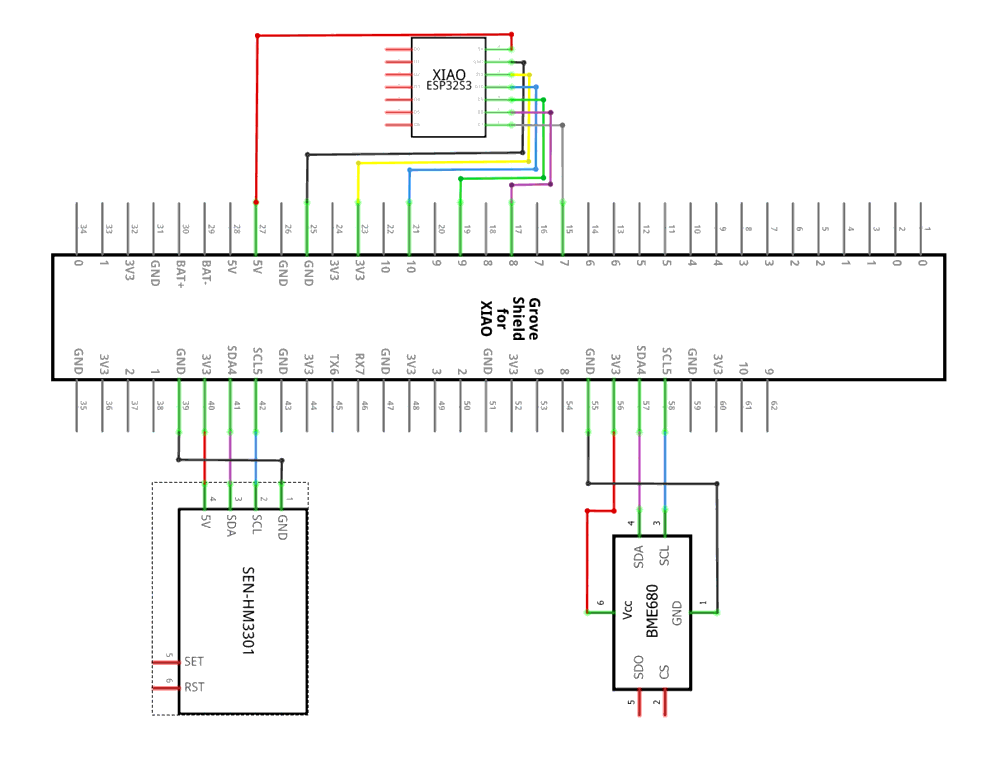
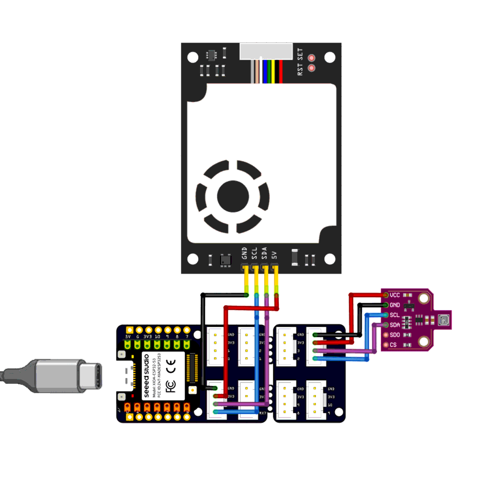

### DIY PCB with XIAO ESP32-C3 / S3 / S3+LoRa

| Component | Sensor pin | Mainboard pin | Signal |
|---|---|---|---|
| USB Type-C breakout | VBUS / 5V | 5V / VIN | Power in (+5 V) |
| BME680 | VCC | 3.3V | Power |
| | GND | GND | Ground |
| | SDA | **D4** | I²C data |
| | SCL | **D5** | I²C clock |
| HM3301 | VCC | 5V | Power |
| | GND | GND | Ground |
| | SDA | D4 (parallel with BME680) | I²C data |
| | SCL | D5 (parallel with BME680) | I²C clock |
| LoRa module | Header | Direct plug / SPI header | Direct |

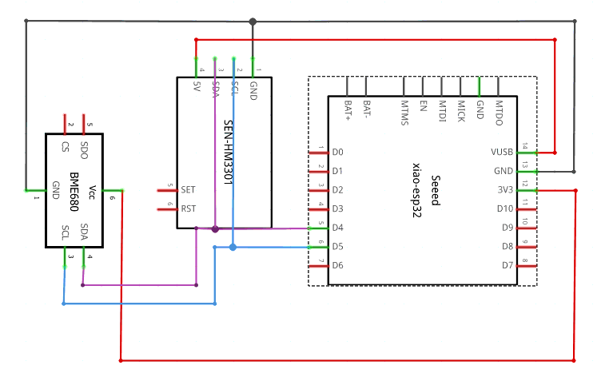
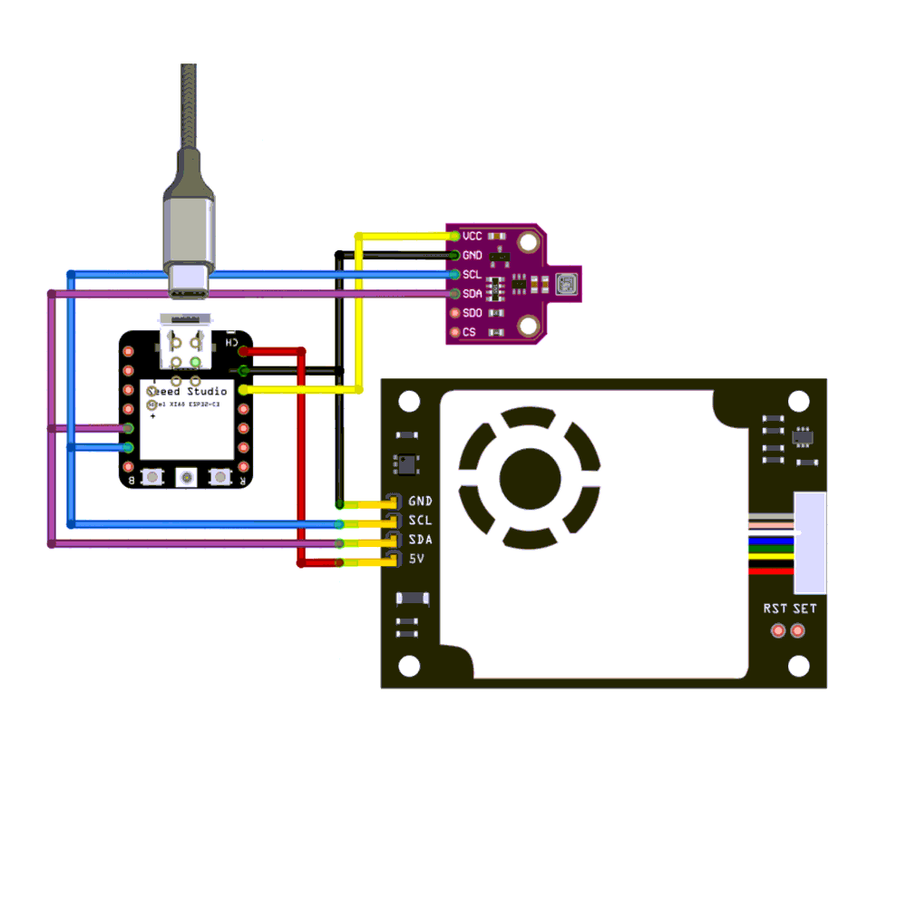

### DIY PCB with ESP32-C3 / ESP32-S3 Supermini

| Component | Sensor pin | Mainboard pin | Signal |
|---|---|---|---|
| USB Type-C breakout | VBUS / 5V | 5V / VIN | Power in (+5 V) |
| BME680 | VCC | 3.3V | Power |
| | GND | GND | Ground |
| | SDA | **D8** | I²C data |
| | SCL | **D9** | I²C clock |
| HM3301 | VCC | 5V | Power |
| | GND | GND | Ground |
| | SDA | D8 (parallel with BME680) | I²C data |
| | SCL | D9 (parallel with BME680) | I²C clock |
| LoRa module | Header | Direct plug / SPI header | Direct |

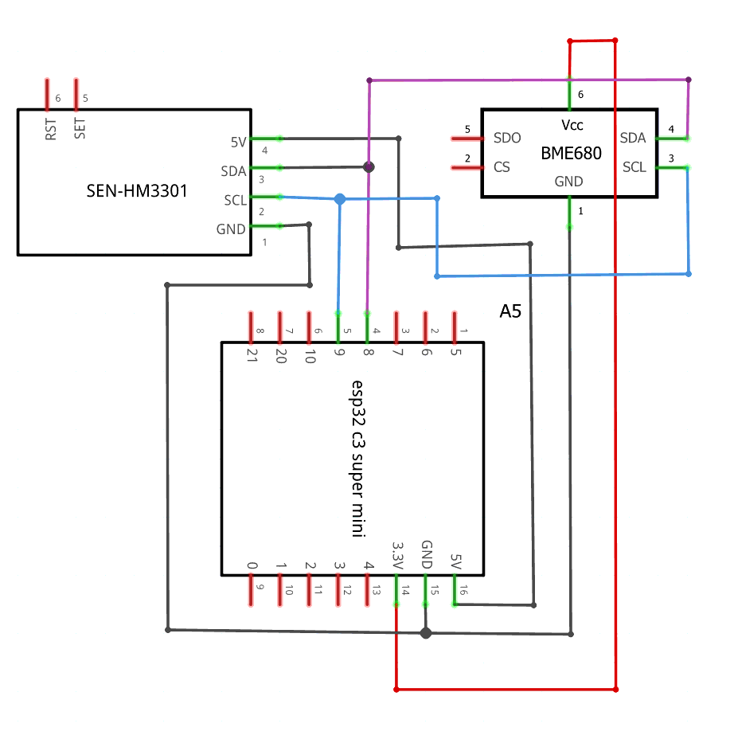
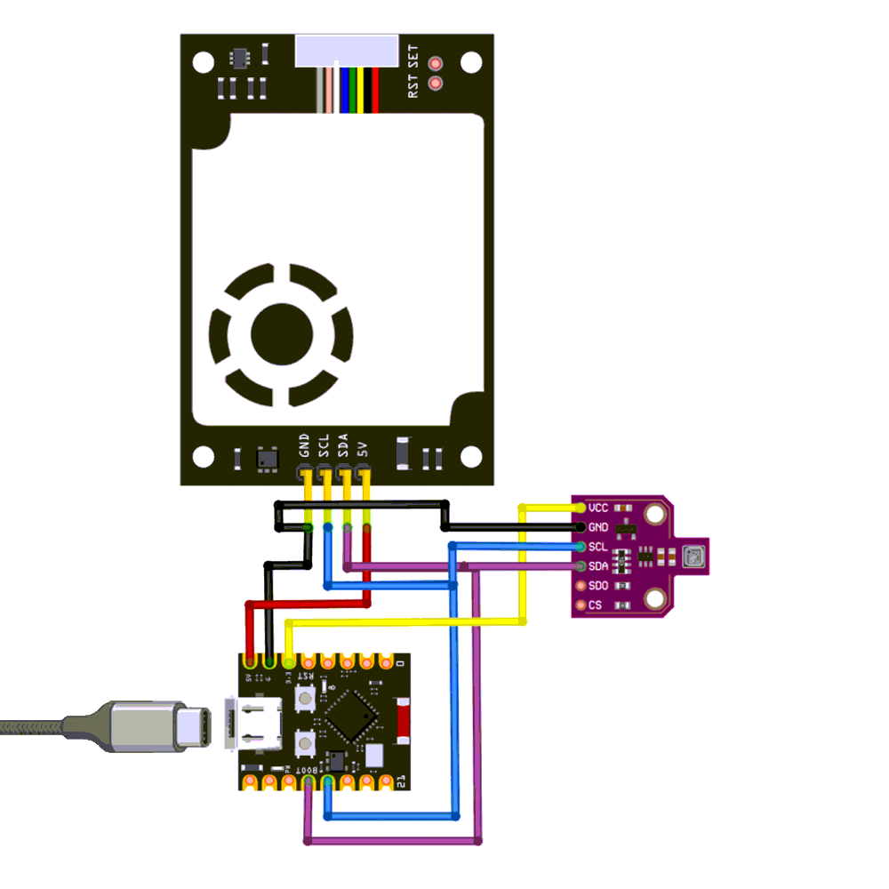

## Assembly

No screwdriver. Every internal joint is a snap fit.

1. **Body.** Fit the SMA pigtail(s) through the antenna hole(s) in
   `MAIN_BODY_1_ANTENNA.stl` or `MAIN_BODY_2_ANTENNA.stl` and tighten the nut from outside.
   This is the only fastener in the build.
2. **BME680.** Drop the sensor into its pocket in the floor of the body. Press the matching
   cover — Bosch or Seeed — until the cantilever hooks click.
3. **HM3301 and duct.** Seat the PM sensor in its compartment. Fit
   `OUTFLOW_DUCT_HM3301.stl` into the exhaust channel. Press the matching HM3301 cover —
   Grove Shield or DIY PCB — over the sensor until its hooks engage.
4. **Mainboard.** Press the board down onto the cantilever hooks moulded into the HM3301
   cover. Connect the JST/Grove cables from USB-C, BME680 and HM3301, and clip the pigtail
   onto the U.FL port.
5. **Close.** Position `TOP_COVER.stl` and press all four sides down until the detents click.

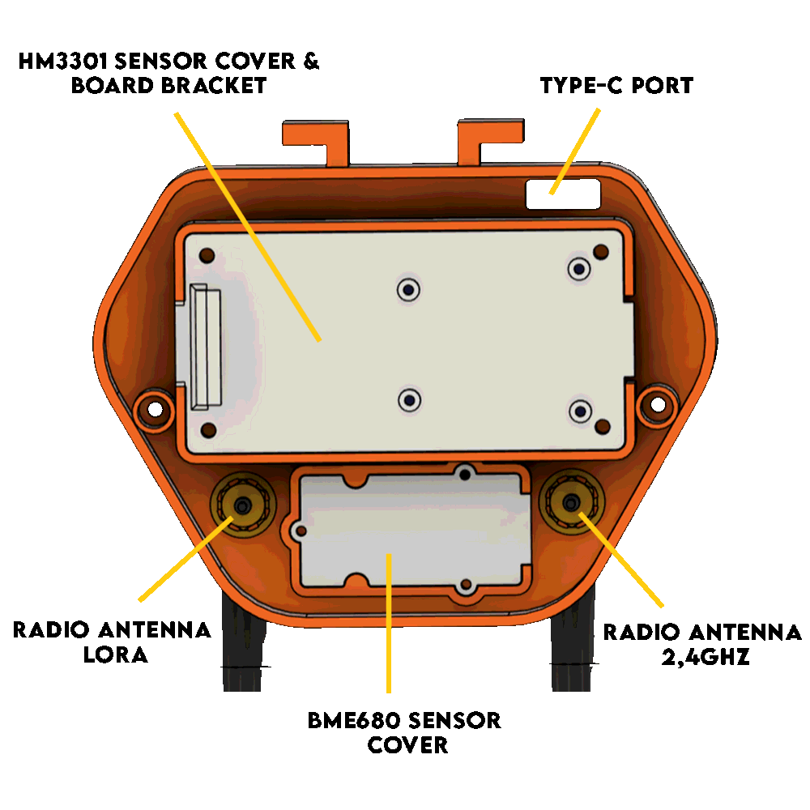
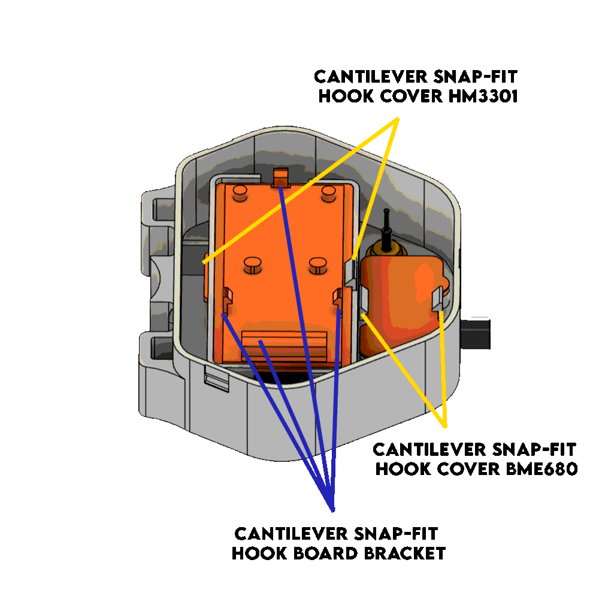
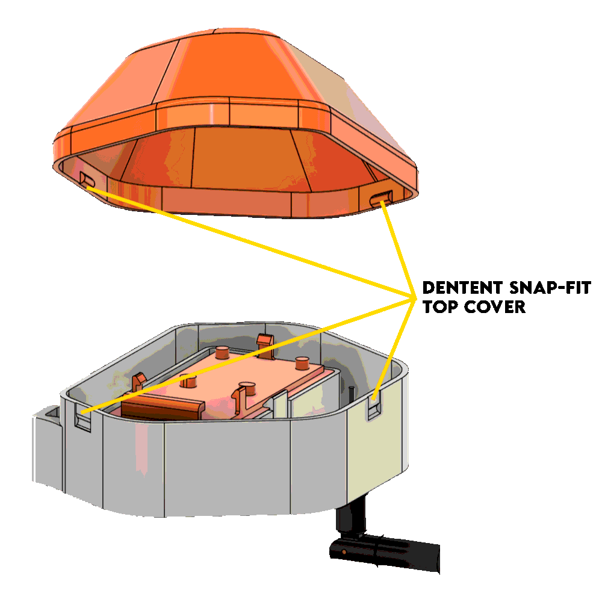

Board bracket, by mainboard:

| | |
|---|---|
| 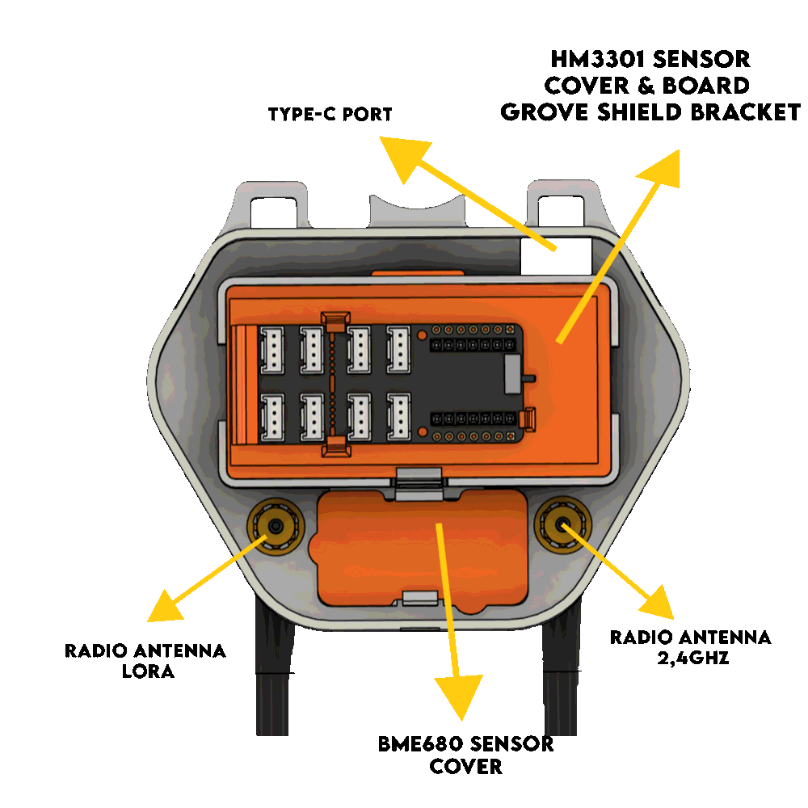 | 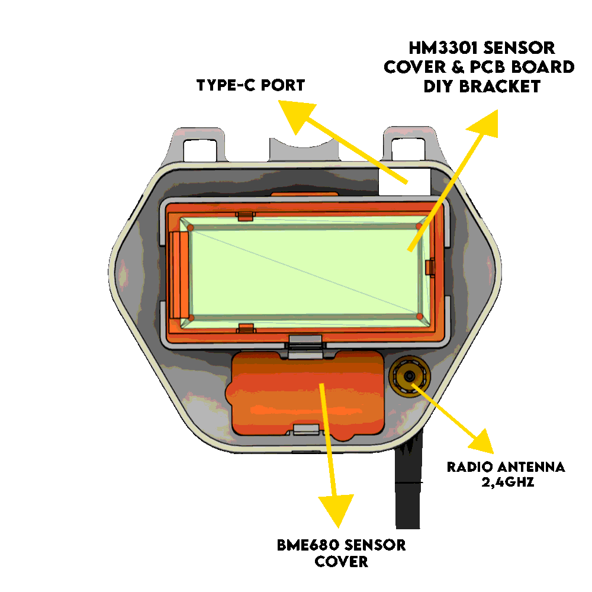 |

<!-- TODO: photograph a real assembly. Every image here is a CAD render. A builder needs
     to see the hook engaged, and how much force "until it clicks" actually is. -->

## Mounting

No printed bracket. Both options are moulded into the back of the body.

- **Flat wall.** Put two screws or nails in the wall and hang the body on the moulded screw
  holes.
- **Pole or tree.** Thread two cable ties through the integrated slots, wrap, pull tight.

<!-- TODO: screw spacing and hole diameter for the wall option; maximum pole diameter for
     the cable-tie slots. Both are readable from the CAD, neither is in the source. -->

Siting matters more than the bracket. Mounting height, what the inlet faces, and what
shades it are on the campaign's site card — see the
[workshop documentation](../../../../docs/) before choosing a spot.

## Firmware and data flow

Unchanged for the whole V3 generation. See [`../../firmware/`](../../firmware/) for the
sketch, and the campaign's Smart Citizen integration notes for the MQTT transport — DIY
nodes publish on `device/sck/<device_token>/readings` over TLS on 8883, and the device
token is the whole identity.

## Known issues with these files

Found by mesh inspection on 2026-09-23, before publication:

- **`OUTFLOW_DUCT_HM3301.stl` has 1 open edge and 1 degenerate (zero-area) triangle.**
  Carried over unchanged from v6, where the same defect was flagged and not fixed. Slicers
  usually repair it silently, which means the result is whatever your slicer decided.
  Re-export from source.
- **The other seven parts are watertight** with no degenerate triangles. Worth noting that
  v6's `Main_Body.stl` had 4 open edges and v7's bodies have none — the body was re-exported
  cleanly somewhere between the two.
- **No CAD source is published.** See [`cad/README.md`](cad/README.md). This is the blocker
  on calling the design replication-ready, and it is the same blocker v6 has.

## What this documentation is still missing

Ten open items, greppable as `TODO` in the source of this file. The blocking ones first:

1. **CAD source.** STLs are an export, not a design. Nobody outside Fab Lab Bali can change
   a hook angle, move a port, or fit a different sensor.
2. **A co-located V3.2.** Two of V2's three documented failures are unaddressed in the
   geometry. Until a unit has run a week beside an SCK, the T/RH channels are unverified
   and the PM peaks are suspect.
3. **Print settings.** Nothing is known. On a snap-fit design, orientation and perimeter
   count decide whether the thing assembles at all.
4. **Cost.** No price for this build, in any currency.
5. **Assembly photographs.** Every image is a render.
6. **Wall-mount screw spacing and hole diameter; maximum pole diameter.**
7. **Assembled outer dimensions and mass.**
8. **Build time**, in minutes, for someone who has not built one before.
9. **Ingress rating.** The V3 source claims splash resistance for the generation but names
   no test and no rating.
10. **Antenna choice.** Gain, and whether the two-antenna variant has a measured isolation
    problem between the 2.4 GHz and sub-GHz ports.

Two errors in the source document were corrected rather than copied, and both should go
back to Fab Lab Bali:

- The Grove Shield wiring table gives the HM3301 3.3 V; its own schematic gives 5 V.
  Corrected to 5 V here. Following the table would leave the fan and laser dead.
- The V3.1 assembly section names `V3.1_Top_Cover.stl` and `V3.1_Wall_Bracket_Separate.stl`;
  no such files exist in either release. The real names are `TOP COVER.stl` and
  `BRACKET TO WALL.stl`. Documented in [`../node-v3.1/`](../node-v3.1/).

---

*Making Sense Bali · Chapter Fab City Bali · hosted by Fab Lab Bali.
Hardware CERN-OHL-W-2.0 · documentation CC-BY-SA-4.0.*
