**English** · [Bahasa Indonesia](README.id.md) · [Español](README.es.md)

# DIY Node V2 — the compact triangular node

*Making Sense Bali · Chapter Fab City Bali · built and tested at Fab Lab Bali*

**Seeed Studio XIAO ESP32-C3 + Seeed Grove HM3301 + Bosch BME680**, all three laid side by side on one floor inside a printed triangular shell. Built to put an ambient air-quality node at banjar, school and warung scale in Desa Serangan for roughly the price of a phone.

> **Status: built, deployed, field-evaluated, and superseded by its own results.**
> Two of the three design goals were met. The third was not: the enclosure heats its own
> temperature sensor and its underside intake lags real pollution peaks. **Don't print this
> shell for a deployment.** Read [Evaluation](#evaluation--what-the-field-test-showed) first,
> then build [the pine cone](../enclosure/) instead. This folder is kept because a design that
> failed for two nameable reasons is worth more to the next builder than one that merely worked.

> **Naming, so nobody loses a day to it.** "V2" here is the second generation of the *whole
> node* as Fab Lab Bali numbers it. It is **not** `enclosure/archive/v2-lantern/`, which is a
> separate enclosure lineage (v1-box → v2-lantern → v3-gourd → v4-column → v5 pine cone). Two
> different design tracks, two different countings. The electronics and firmware are shared;
> the shells are not related.

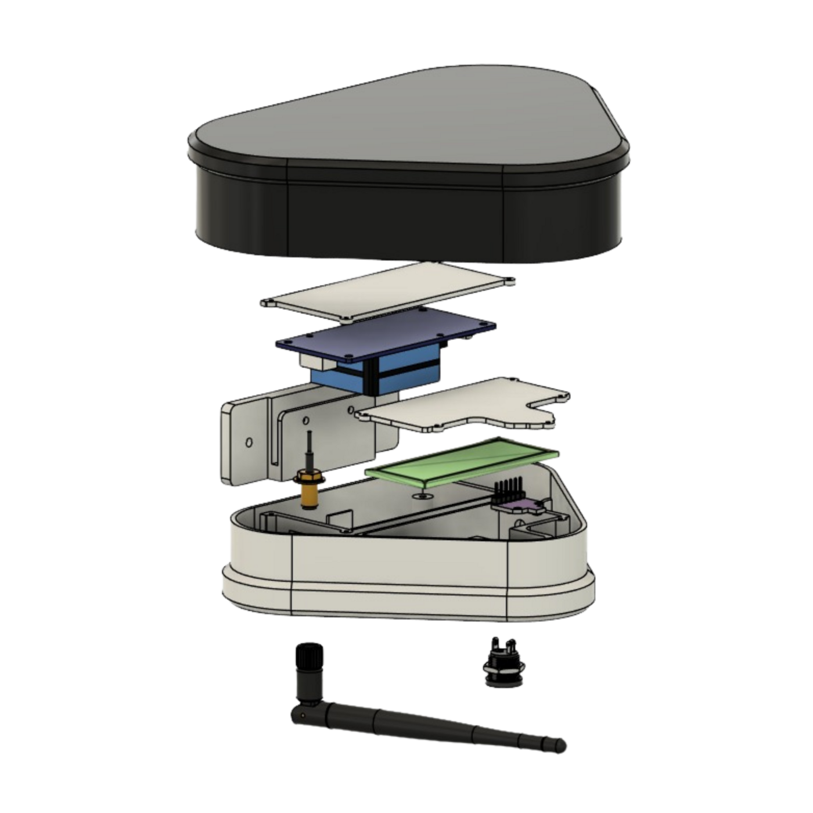

## Contents

- [Why it was built](#why-it-was-built)
- [The concept](#the-concept)
- [Where the form came from](#where-the-form-came-from)
- [Physical architecture and airflow](#physical-architecture-and-airflow)
- [Electronics](#electronics)
- [Bill of materials](#bill-of-materials)
- [The custom mainboard](#the-custom-mainboard)
- [Internal layout](#internal-layout)
- [Base plate — power, RF, air](#base-plate--power-rf-air)
- [Assembly](#assembly)
- [Firmware and data flow](#firmware-and-data-flow)
- [Evaluation — what the field test showed](#evaluation--what-the-field-test-showed)
- [What V3 has to do differently](#what-v3-has-to-do-differently)
- [Files](#files)
- [What this documentation is still missing](#what-this-documentation-is-still-missing)

## Why it was built

Reference-grade air-quality stations cost more than any banjar, school or neighbourhood group in Bali will ever raise on its own. The campaign's own tier table puts them at [USD 5,000–25,000+](../README.md#where-this-fits--the-campaigns-sensor-tiers). Assembling something from cheap modular sensors is the obvious alternative, and it is what this whole folder tree is about.

The hard part is not the electronics. It is the box.

A carelessly shaped enclosure becomes a trap: it holds the microelectronics' own waste heat inside, or it chokes the outside air before it reaches the sensor. Either way the node reports numbers that describe the inside of a plastic shell rather than the air of the place it was hung in — and it reports them with the same confident precision as a correct reading, which is what makes the failure dangerous rather than merely annoying.

| | |
|---|---|
| Fixed reference station | 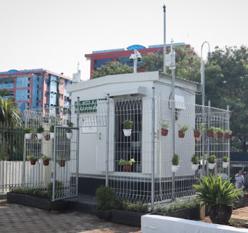 |
| Mobile reference station | 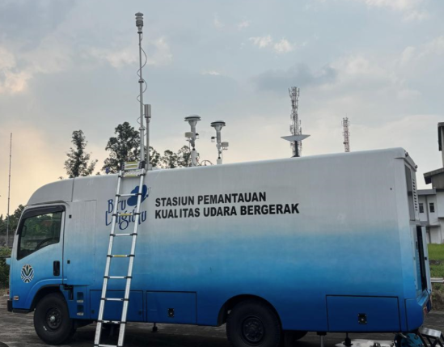 |

## The concept

A compact horizontal chassis. Every component lies flat on a single floor in a **side-by-side configuration**, separated by an internal divider wall, so the node stays small enough to carry in one hand and presentable enough to hang on a wall someone else owns.

Three goals were set at the start:

1. Cut production cost by ~90% against a standard industrial station.
2. Produce a shell that is sturdy, compact, printable on a local 3D printer, and safe from splashing water.
3. Get precise daily environmental readings.

Goals 1 and 2 held up. Goal 3 did not — see the evaluation.

> **On the 90% figure.** The source document states it two ways: once as a 90% cut in *chassis* production cost, once as a 90% cut in *total* production cost. Neither version names the baseline station it is measured against, so as written the claim can't be checked. Against the campaign's own Tier 0 range the real saving is far steeper than 90%, so this is likely conservative rather than inflated — but a replicator quoting it to a funder should name a specific station and its price first. <!-- TODO: pick a named baseline station + price, restate the claim once, in one form. -->

| | |
|---|---|
| 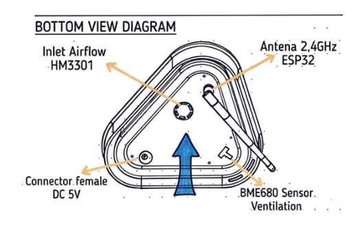 | 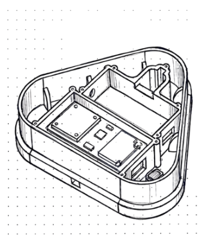 |

## Where the form came from

The compartment layout is taken directly from the enclosure architecture of the **Smart Citizen Kit station (SCK 2.3)** — the source document names modularity, cleanness and minimalism as what it took from it. Note that the campaign's own calibration backbone is the **SCK 2.1** ([tier table](../README.md#where-this-fits--the-campaigns-sensor-tiers)); 2.3 is a later kit, so this is a borrowing from the product line rather than from the exact station Node V2 was later measured against.

| | |
|---|---|
| 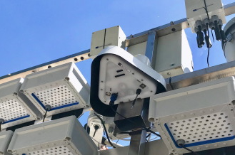 | 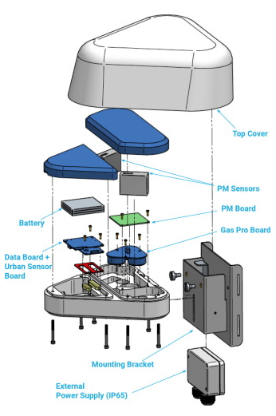 |

Camprodon, G., González, Ó., Barberán, V., Pérez, M., Smári, V., de Heras, M.Á., Bizzotto, A., *Smart Citizen Kit and Station: An open environmental monitoring system for citizen participation and scientific experimentation*, HardwareX 6 (October 2019). <https://www.sciencedirect.com/science/article/pii/S2468067219300203>

## Physical architecture and airflow

The shell is an obtuse triangle in plan, its interior split by partitions. The airflow path, as designed:

- Components sit flat on one chassis floor. A mechanical divider separates the main module (XIAO ESP32-C3) from the sensor compartment.
- Outside air is drawn in from **underneath** the case through a small grille, moved horizontally across the interior, and exhausted out of the **side**.
- The BME680 gas and micro-climate sensor sits inside the main chassis, **facing down** toward the ground, with no external radiation shield over it.

Both of those last two decisions are the ones the field test overturned. They are written here as designed, not as recommended.

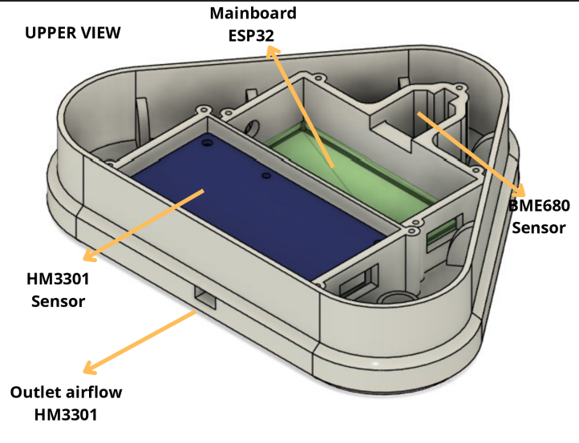

## Electronics

Two sensors share one I²C bus as slaves to the XIAO ESP32-C3 master.

| From MCU (XIAO) | To sensor | Function | Wire colour |
|---|---|---|---|
| GND (pin 13) | BME680 + HM3301 | Shared ground | Black |
| 5V (pin 14) | HM3301 dust sensor | 5 V main power | Red |
| 3V3 (pin 12) | BME680 gas sensor | 3.3 V logic power | Yellow |
| D4 (pin 5) | BME680 + HM3301 | Serial data (SDA bus) | Purple |
| D5 (pin 6) | BME680 + HM3301 | Serial clock (SCL bus) | Blue |

I²C addresses, from the shared firmware: **HM3301 at `0x40`**, **BME680 at `0x76`** (falls back to `0x77` if SDO is pulled to 3V3).

**Pin 14 is silkscreened `5V`** on the board; the source document calls it VUSB. On a XIAO it is normally the USB VBUS rail, but Node V2 feeds it the other way — from the base plate's DC jack, through the mainboard's screw terminal. Either way the HM3301's fan and laser are the only things on 5 V, so a XIAO running from its BAT pads alone would leave the dust sensor dead. The bill of materials carries no cell, so this build never hits that case; it matters if someone adapts it. <!-- TODO: confirm on a physical unit whether the DC jack back-feeds the 5V pad or is wired to the sensor socket directly. -->

| | |
|---|---|
| 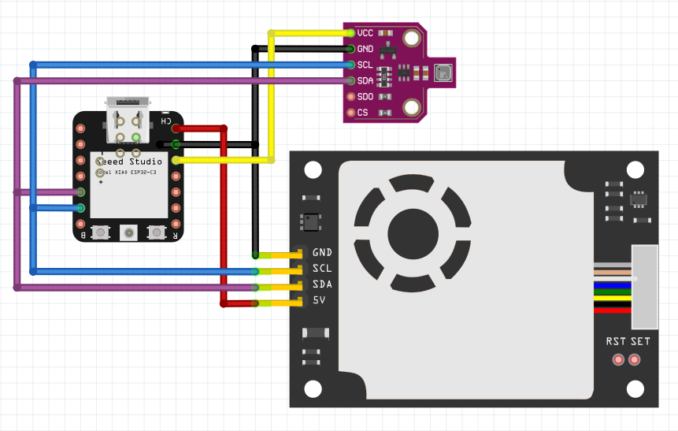 | 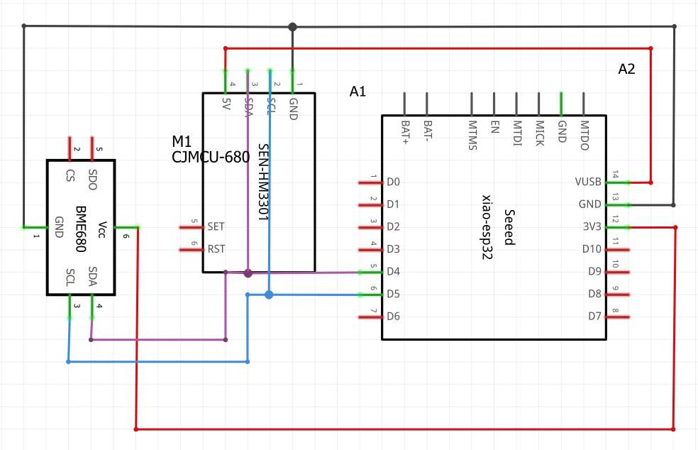 |

## Bill of materials

Machine-readable version with sourcing columns: **[`bom.csv`](bom.csv)**.

| # | Component | Specification | Qty | Unit (IDR) | Total (IDR) |
|---|---|---|---|---|---|
| 1 | Seeed Studio XIAO ESP32-C3 | RISC-V MCU, Wi-Fi/BLE, USB-C | 1 | 165,000 | 165,000 |
| 2 | Seeed Grove HM3301 | Laser-scattering particulate matter sensor | 1 | 700,000 | 700,000 |
| 3 | CJMCU-680 (BME680) | 4-in-1 environmental gas sensor breakout | 1 | 282,000 | 282,000 |
| 4 | Node V2 3D-printed shell | Custom triangular case, PETG | 1 | 65,000 | 65,000 |
| 5 | Wiring harness | Dupont female jumpers + Grove 4-pin cable | 1 lot | 35,000 | 35,000 |
| 6 | Machine screw M2 × 6 mm | Flat head, carbon steel (NINDEJIN) | 15 | 200 | 3,000 |
| 7 | Machine screw M3 × 6 mm | Flat head, carbon steel (NINDEJIN) | 4 | 300 | 1,200 |
| 8 | Machine screw M3 × 10 mm | Flat head, carbon steel (NINDEJIN) | 4 | 400 | 1,600 |
| 9 | Machine screw M3 × 14 mm | Flat head, carbon steel (NINDEJIN) | 2 | 500 | 1,000 |
| | | | | **Total** | **Rp 1,253,800** |

The source document gives these figures without saying where or when the parts were bought, so treat them as one build's cost in Indonesia rather than a price list. The parent README's [sourcing note](../README.md#choosing-between-them) is the better guide for anyone ordering: the HM3301 is the cost driver, and going direct from Seeed usually beats local retail for a batch. Any equivalent flat-head machine screw substitutes for the branded ones.

<!-- TODO: where and when the parts were bought, and whether these are retail or distributor prices. -->
<!-- TODO: USD equivalent + the IDR/USD rate on the purchase date, so the figure stays comparable to the USD costs quoted in ../README.md. -->
<!-- TODO: what the shell's Rp 65,000 covers (filament only, or filament plus machine time) and the PETG mass in grams, so it can be recomputed anywhere. -->

## The custom mainboard

Loose Dupont wires in a chassis this tight turn into a maintenance problem within one service visit, so the XIAO is not wired directly. It is soldered onto a **3 × 7 cm perfboard** that acts as a small carrier board.

**Top side.** The XIAO sits in the middle. A JST/Grove 4-pin socket on each side gives the sensors a plug-and-play connection. A green screw terminal takes the main power input.

**Bottom side.** Point-to-point solid jumper wire. Red (5 V / 3.3 V) and black (GND) run in parallel as the power bus; green and blue distribute the I²C bus (SDA and SCL) in parallel to both sensor sockets.

| | |
|---|---|
| 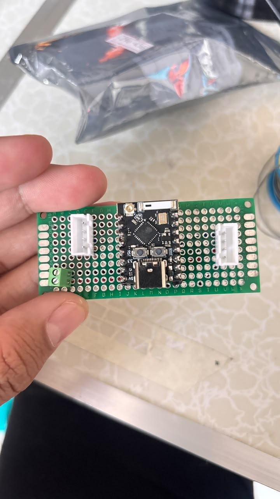 | 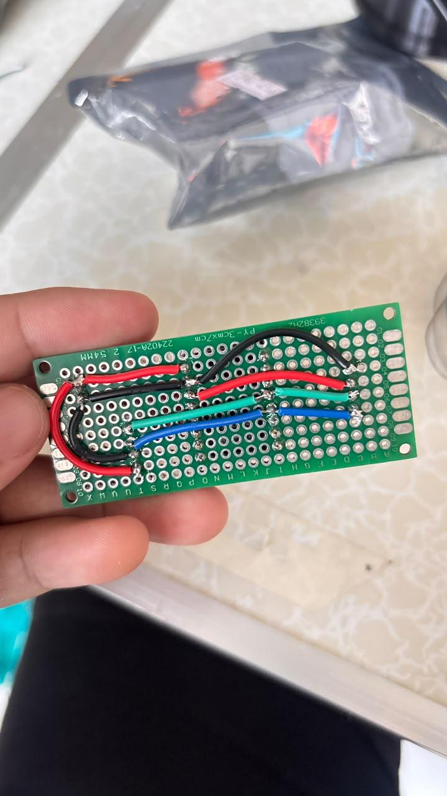 |

> **Colour-code conflict, unresolved.** The wiring table above gives **purple = SDA, blue = SCL**. The perfboard's own jumpers use **green and blue** for the same two signals. Both statements come from the source document. Whichever is right, the two colour codes disagree, and a replicator following one while looking at a photo of the other will swap SDA and SCL — which presents as "sensor not found" and sends you hunting a power fault. <!-- TODO: check a physical unit, pick one colour code, correct the other. -->

## Internal layout

The printed shell divides the floor horizontally, with moulded screw bosses locking each part in place.

**Left bay — dust.** The HM3301 laser module, fixed with four M2 screws straight into the lower chassis.

**Centre bay — the brain.** The XIAO perfboard mainboard, seated in its channel at a deliberate clearance from the dust sensor so nothing shorts.

**Triangle tip — micro-climate.** The BME680 (the purple PCB) in the sharpest corner of the shell, pushed back toward the chassis gap so it picks up outside temperature and humidity changes faster.

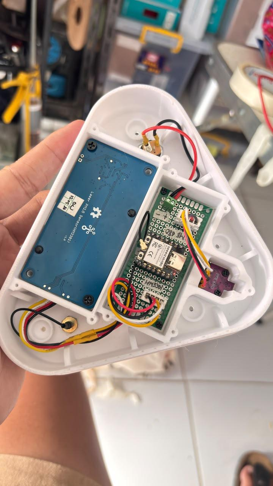

## Base plate — power, RF, air

Every external interface is concentrated on the white bottom plate, which keeps the sides clean and the connectors out of the rain.

- **Power in.** A DC female jack, soldered and sleeved in yellow heat-shrink, feeding 5 V DC to the mainboard's screw terminal.
- **RF.** An SMA pigtail through the plate, with an external 2.4 GHz omni antenna aimed down-and-sideways so the Wi-Fi link survives a banjar building's walls.
- **Air.** A circular grille directly beneath the HM3301's intake fan, which is the node's main ambient-air entry.

| | |
|---|---|
| 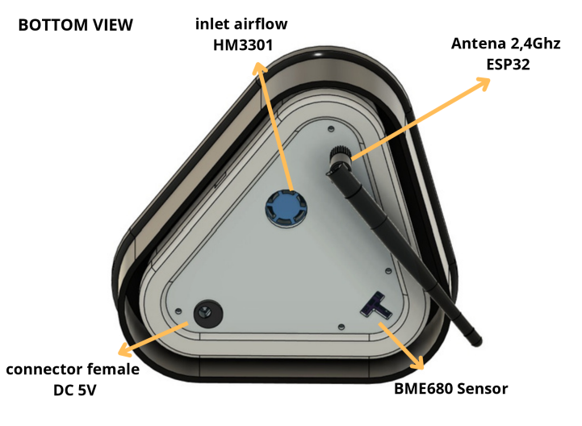 | 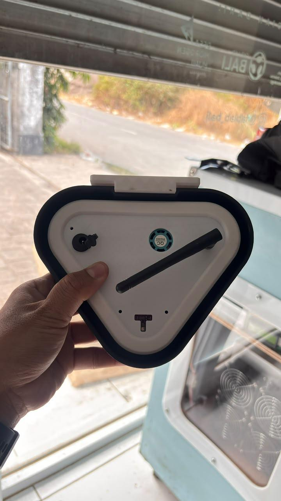 |

## Assembly

Tools: soldering iron, screwdriver to match your screws, wire cutters and strippers, heat gun or lighter for the heat-shrink. <!-- TODO: build time. The source document doesn't record one; the parent README's ~3 hours is for a different build. -->

1. **Print the shell** in PETG, not PLA — [PLA softens at Bali rooftop temperatures](../README.md#basic--xiao-esp32-s3--bme680-usd-1525). <!-- TODO: layer height, wall count, infill, nozzle/bed temperature, print orientation, support needs, print time. None of this is in the source document and all of it is needed to reprint the part. -->
2. **Build the mainboard.** Solder the XIAO to the centre of the 3 × 7 cm perfboard, the two Grove/JST sockets either side, and the screw terminal. Then run the underside buses point-to-point: red and black in parallel for power, the two I²C lines in parallel to both sockets.
3. **Fit the base-plate hardware.** Solder the DC jack's leads, sleeve the joints with heat-shrink, and mount the SMA pigtail. Do this before anything else goes in the shell — the plate is easier to work on empty.
4. **Mount the dust sensor.** HM3301 into the left bay, four M2 × 6 screws into the chassis bosses, intake fan facing the circular grille.
5. **Mount the mainboard.** Perfboard into the centre channel, screwed down, checking clearance to the dust sensor.
6. **Mount the BME680** in the triangle tip, pushed back toward the chassis gap.
7. **Connect.** Grove cable from the mainboard socket to the HM3301; the BME680's four wires to the other socket. Antenna to the XIAO. DC jack leads into the screw terminal.
8. **Flash and check** before closing the shell — see below. Edit `SC_DEVICE_TOKEN` in the sketch to this node's own Smart Citizen token before flashing, then provision Wi-Fi at first boot through the `MakingSenseBali-XXXX` captive portal. In the serial output, `[hm3301] online at 0x40` names its address; the BME680 line reports only that it answered, not which of `0x76` / `0x77` it answered on.
9. **Close** with the M3 screws (6, 10 and 14 mm; the shell's bosses determine which goes where).

> Steps 2, 5 and 7 are the three that most need a photo taken from directly above with the parts labelled. The two mainboard photos above cover step 2 reasonably; steps 5 and 7 currently rely on one general interior shot. <!-- TODO: photograph steps 5 and 7. -->

**Before deploying**, coat the soldered side of the perfboard with silicone conformal coating, masking the sensor openings and the USB-C connector. Bali runs above 80% relative humidity most of the year and uncoated boards corrode inside 6–12 months; the reasoning and the product are in [the parent README](../README.md#bali-deployment-notes).

## Firmware and data flow

Node V2 runs the campaign's shared DIY-node sketch with no code changes beyond the per-device Smart Citizen token: **[`../firmware/diy_node/`](../firmware/diy_node/)**. The same file targets both the XIAO ESP32-S3 and the ESP32-C3 — pin mapping for D4/D5 resolves per board variant, so nothing in it is chip-specific.

Every 60 seconds the XIAO addresses each sensor in turn over I²C, packs the readings as JSON, and publishes over Wi-Fi via MQTT on port 8883 to `mqtt.smartcitizen.me`, where the campaign dashboard reads them. The connection is TLS but **certificate validation is off** in this firmware version (`net.setInsecure()`) — fine for a workshop kit, not for a node whose data goes into a policy argument. The sketch says as much where it happens.

Smart Citizen global-catalogue channel IDs this node publishes on:

| ID | Channel | Unit |
|---|---|---|
| 233 / 234 / 235 | HM3301 PM1.0 / PM2.5 / PM10.0 | µg/m³ |
| 237 / 238 | BME68X temperature / humidity (see note) | °C, %RH |
| 239 | BME68X pressure | kPa |
| 240 | BME68X gas resistance | Ω (raw) |
| 241 | BME68X IAQ | index, open approximation |

> **Channels 237 / 238 are named "heat-compensated" in the Smart Citizen catalogue.** The firmware publishes the BME680's values straight through, with no enclosure compensation applied. On this node in particular the name promises something the data doesn't carry — which is exactly the error the evaluation went on to measure.

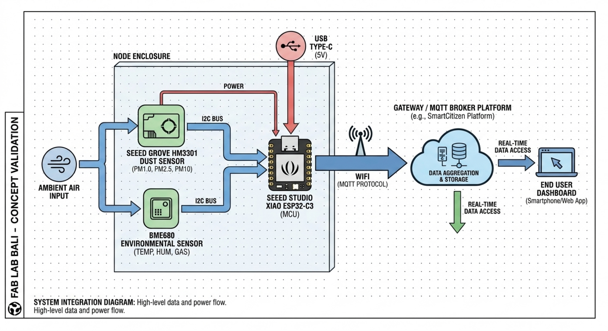

> **Documentation vs. code, flagged.** The source document describes raw readings being "filtered through a local calibration calculation to eliminate chassis error" before publishing. **There is no such function in the linked firmware.** It publishes temperature and humidity raw, plus an explicitly uncalibrated on-device IAQ approximation. Two reasons this matters: the described function doesn't exist, and if someone adds it, it works against the campaign's stated policy that [corrections live in the dashboard processing layer, not the firmware](../README.md#the-calibration-chain) — firmware corrections are unauditable, dashboard corrections are versioned. The self-heating the evaluation found is a real error that wants a real correction; the place for it is the pipeline. <!-- TODO: delete this claim from circulation, or point at whatever code actually implements it. -->

## Evaluation — what the field test showed

Node V2 was run alongside a Smart Citizen Kit reference station. Two results, pointing in opposite directions.

**Temperature reads high.** The XIAO ESP32-C3's Wi-Fi radio puts out heat continuously. Sitting beside the BME680 in one closed compartment, that heat conducts through the plastic and into the sensor. Node V2's temperature ran well above the actual weather outside the shell. Relative humidity goes wrong alongside it: a sensor sitting in air warmer than ambient reads that air as drier than the outside air actually is. The source document reports the temperature error only, so treat the humidity consequence as inference rather than a measured result.

**Particulates lag.** Putting the air intake underneath the case restricts particle circulation. When ambient dust spiked, Node V2 responded late: fresh air was slow through the narrow underside grille, the trend line flattened, and the real pollution peak never made it into the record. For a campaign whose whole argument rests on catching open-burning events, a node that smooths peaks is worse than one that is merely noisy.

Neither failure announces itself. Both produce plausible-looking data. That is the point of writing them down.

## What V3 has to do differently

1. **Intake from the top or open sides, not the bottom.** The downward-facing inlet is disproved. V3 goes back to a vertical airflow path.
2. **Get the BME680 out of the main compartment.** It needs to sit outside the electronics bay, under a multi-louvered solar radiation shield, so it reads ambient air instead of the microcontroller's exhaust.

Both of these are already solved in [the current v5 pine-cone enclosure](../enclosure/), which puts every breathing slot in a scale's rain shadow and runs a chimney from a low intake at the BME680's level to a high exhaust under the cap. If V3 is a new design rather than an adoption of v5, that folder is the thing to read first.

There is a third lesson the evaluation implies without stating: **compactness and thermal isolation are in direct conflict**, and V2 chose compactness without pricing the trade. A shell that houses a radio and a temperature sensor in one sealed volume will report the radio's temperature. Either separate them physically, or accept that the temperature channel is diagnostic rather than ambient and say so on the dashboard.

## Files

| What | Where |
|---|---|
| Firmware (shared with the whole DIY node family) | [`../firmware/diy_node/`](../firmware/diy_node/) |
| Bill of materials, machine-readable | [`bom.csv`](bom.csv) |
| Photos, renders and diagrams | [`img/`](img/) |
| Enclosure files, Node V2 | [Google Drive folder](https://drive.google.com/file/d/1OdK7mdnLc2XkGRntHOQXK7PGmcP8E4bJ/view?usp=sharing) — **not yet in this repo** |
| SCK station reference paper | [HardwareX 6 (2019)](https://www.sciencedirect.com/science/article/pii/S2468067219300203) |
| Current recommended enclosure | [`../enclosure/`](../enclosure/) |

## What this documentation is still missing

Listed plainly, because a reader deserves to know which gaps are gaps rather than discovering them at the printer.

- **The CAD source is not here, and neither is an STL.** The enclosure lives in a Google Drive folder outside the repo. Right now nobody can reprint this shell from the repository, and if the Drive link rots the design is gone. This is the single blocking gap: [open hardware needs both the editable source and the build-ready export](https://open-make.github.io/Hardware-template-guide/), and this folder currently has neither.
- **No print parameters.** Layer height, walls, infill, temperatures, orientation, supports, print time. The part cannot be reproduced consistently without them.
- **No shell dimensions or wall thickness**, so the design can't be adapted or sanity-checked.
- **The SDA/SCL colour code contradicts itself** between the wiring table and the perfboard.
- **The "local calibration" claim** has no corresponding code.
- **No measured numbers on the failures.** "Reads hotter" and "lags" are the right findings, but a Δ°C against the SCK and a lag in minutes would let the next design set a target instead of a direction. If the co-location data still exists, it belongs here.
- **Eleven screws with no destination.** The BoM buys 15 M2 × 6; four hold the HM3301 down and the rest are unaccounted for in any assembly step.
- **No repair or disposal notes.** Fine at this stage; required before anyone calls the design replication-ready.

Documented against the [Open-Make Hardware Template Guide](https://open-make.github.io/Hardware-template-guide/) — Colomb, J. (2025), *Guide and template for hardware project documentation*, Zenodo, [doi:10.5281/zenodo.14725490](https://doi.org/10.5281/zenodo.14725490). Development stage: **prototyping**, evaluated and superseded.

## License

MIT, same as the parent repository. The SCK station reference is the authors' own work, cited above. Fork it for Making Sense [your place] — and if you build the V3 this design argues for, put it back in a folder next to this one.
